# Cocoa包管理器之CocoaPods详解 - 青玉伏案 - 博客园
CocoaPods在Cocoa开发日常工作中经常用到的包管理器，即依赖管理工具。有的项目也有用 **Carthage** 的，Carthage是一个比较新的依赖管理工具，是使用Swift语言开发的。Carthage在上家公司的一个项目中实践过一些，用着也挺方便。本篇博客就先系统的了解一下CocoaPods的使用方式和工作原理, 然后在下篇博客中会系统的了解一下Carthage的使用方式和工作原理，这两个依赖仓库系统梳理完毕后，会做一个比较。 

CocoaPods是个老生常谈的话题。在之前的博客中也有相关内容的涉及，但是不够系统全面。本篇博客会系统的梳理一下CocoaPods, 但是接下来几篇博客中会聊一些Carthage以及其源码解析的相关内容。

(注：博客中的有些内容是自己根据具体的事例而总结出来的，有些地方如果理解偏差，还请大家进行斧正)

## **一、What is CocoaPods**

首先来看一下什么是CocoaPods, 下方是 [CocoaPods官网](https://cocoapods.org/) 上对CocoaPods的解释。

> CocoaPods is a dependency manager for Swift and Objective-C Cocoa projects. It has over 45 thousand libraries and is used in over 3 million apps. CocoaPods can help you scale your projects elegantly.  

上面大概意思是 `CocoaPods` 是 `Swift` 和 `Objective-C` 语言中 `Cocoa` 项目中依赖的管理工具。其中涵盖了4.5万个库，被300万个App使用。 `CocoaPods` 可以帮助你优雅的扩从你的项目。

简单点儿说 `CocoaPods` 就是Cocoa工程中被广泛使用的包管理器。

## 

## 二、Install CocoaPods

看完介绍，接下来简单看一下CocoaPods的安装。 `CocoaPods` 的编译和运行需要Ruby环境的支持。在OS X上已经默认安装了Ruby环境，官方推荐使用默认的 `Ruby` 环境。

可以通过下方的命令来安装 `CocoaPods` 。在安装时需添加上 `sudo`, 使用系统权限来进行安装。下方的命令也可以用来更新 `CocoaPods`

> **按照命令：sudo gem install cocoapods**  
> **卸载命令：gem uninstall cocoapods**  

因为我的本地之前已经安装过 `CocoaPods`, 下方是进行的覆盖安装，也相当于更新了。具体如下所示

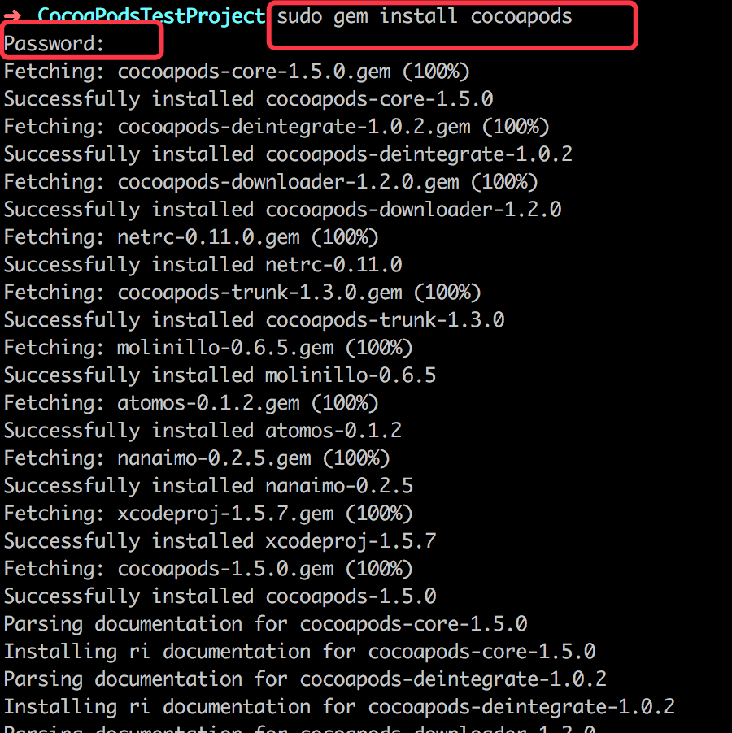
## 三、Get Started

安装完CocoaPods后，来看一下CocaPods的简单使用。虽然在之前的博客中不止一次的用到 `CocoaPods`, 但是在本篇博客安装完 `CocoaPods` 后，接下来我们来简单的感受一下 `CocoaPods` 的具体使用。

### 1、Create Podfile

在 `CocoaPods` 管理的工程中通过名为 `Podfile` 的文本文件来描述相关的依赖信息。下方就是在我们已有的工程中创建了一个 `Podfile` 文件，将下方的内容输入到文件中。在该文件中通过pod来引入相关的仓库，后方跟的是仓库的版本号。下方的 `use_frameworks!` 则表明依赖的库编译生成 `.frameworkds` 的包，而不是 `.a` 的包。

```
platform :ios, '9.0' 
use_frameworks! 
target 'CocoaPodsTestProject' do 
	pod 'AFNetworking', '~> 2.6' 
end
```

下方就是创建 `Podfile` 文件，然后将上述的内容输入到该文件中。

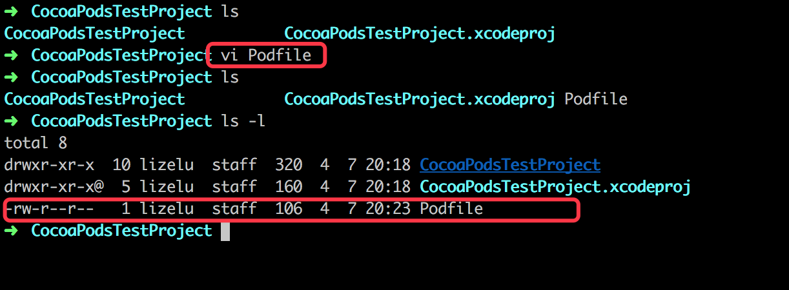
上面的 `platform` 指定的版本是仓库兼容的最小版本。 `target` 则指定的是作用于工程中的那个目标。 `pod` 则用来指定相关的仓库及仓库版本。下方是相关仓库版本的几种常见的指定方式：

* `pod 'xxxx'`  : 后方没有指定版本，则表示使用仓库的最新版本。

* `pod 'xxxx', '2.3'`  : 使用xxxx仓库的 `2.3` 版本。

* `pod 'xxxx', '~>2.3'`: 则表示使用的版本范围是  `2.3 <= 版本 < 3.0` 。如果后方指定版本是 `~>2.3.1`, 那么则表示使用的版本范围是  `2.3.1 <= 版本 < 2.4.0` 。

* `pod 'xxxx', '>2.3'`: 使用大于2.3的版本。

* `pod 'xxxx', '>=2.3'`: 使用2.3及以上的版本。

* `pod 'xxxx', '<2.3'`: 使用小于2.3的版本。

* `pod 'xxxx', '<=2.3'`: 使用小于等于2.3的版本。

除了上述的版本指定方式，我们还可以通过指定相关代码仓库的路径来指定相关的依赖，比如使用 `path` 来指定本地的相关仓库，使用 `git` 来指定远端的git仓库。下方是常用的几种方式：

* `pod 'xxx', :path => '本地代码仓库的路径/xxx.podspec'`  ＃使用该方式可以指定本地存在的依赖路径(podspec文件稍后会结介绍到)。

* `pod 'xxx', :git => 'git仓库地址'`  ＃可以通过git仓库地址来加载相关依赖。

* `pod 'xxx', :git => '本地代码仓库的路径', :tag => '2.2.2'`  :#后方可以跟 `:tag` 参数来指定相关的tag号。当然后边还可以通过 `:branch => '分支号'` 来指定依赖于某个分支，通过 `:commit => 'commit号'` 来指定那个提交。

### 

### 2、Pod Install

配置完 `Podfile` 文件，接下来就是该在相关的工程中安装相关的依赖了。下方使用了 **`pod install`** 来安装相关的依赖，使用 **`pod update`** 来更新相关的依赖。在安装依赖时会提示安装了哪些依赖的库。因为CocoaPods在安装后会修改我们的Xcode工程，生成一个工作空间，这个工作空间由我们的Project工程和Pods工程组成，我们所依赖的仓库就位于这个Pods工程中，所以安装完毕后提示要通过 `xxxx.xcworkspace` 文件来打开整个工程。 `pod install` 完毕后，我们会发现整个工程中多了一些文件，比如 `xxxx.xcworkspace`、`Pods`、`Podfile.lock` 等。我们就通 `xxxx.xcworkspace` 来打开相关文件，其他文件稍后会介绍到。

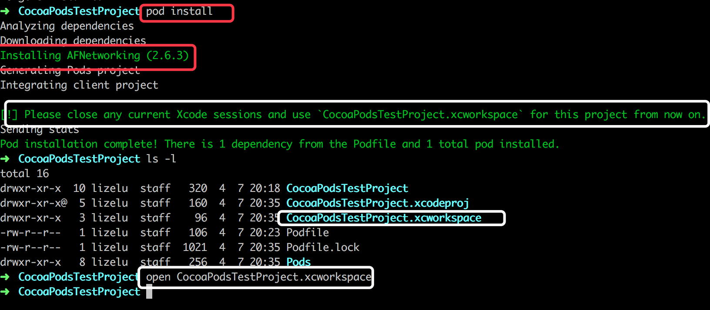
下方就是我们通过 **`open CocoaPodsTestProject.xcworkspace`** 打开的相关工程。下方的Pods中就包括相关依赖的仓库。我们就可以在我们的工程中直接引入使用所依赖的仓库了。上面也提到了，安装后会生成一个工作空间workspace。该workspace就由我们原有的工程和新增的Pods工程组成。通过CocoaPods管理的依赖库都会放在这个Pods工程中。具体如下所示：

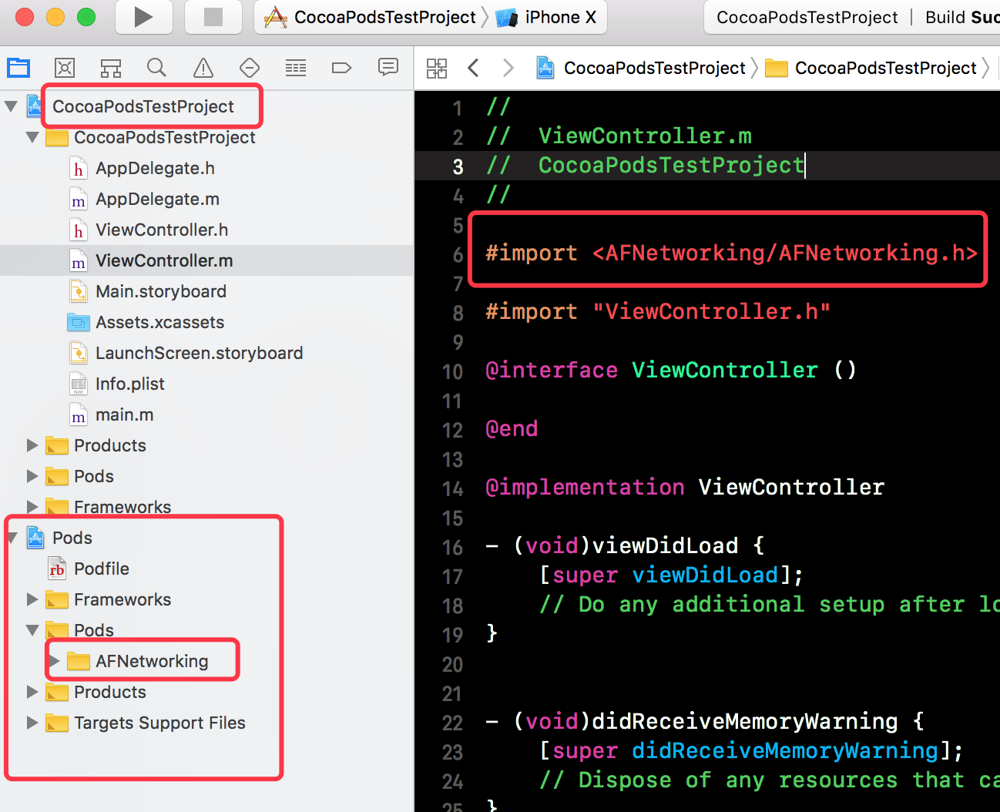
### 3、锁版文件 podfile.lock

上面简单的提了一下 **`podfile.lock`** 文件。咋安装之前我们创建了一个叫做 podfile 的依赖相关的描述文件。在 **`pod install`** 后会生成一个叫做 `podfile.lock` 的文件。下方截图中是该文件中的相关内容。其中记录了目前依赖的一些仓库以及一些版本，该文件的目的就是锁定依赖仓库版本的。该 podfile.lock 本质上是用来锁版本的，为了避免版本不一致的情况发生。

我们来看一下如果没有Podfile.lock文件，会发生什么情况。当在 **podfile** 中添加了相关依赖仓库，但是没有添加相关的依赖仓库的版本，那么在每次 pod insall 时都会安装该仓库最新的版本。当一个工程有多个人开发时，A同学 在 B同学 之前进行的pod install, 而在A同学安装后一些仓库进行了更新，那么在 B同学 安装仓库时就会寻找这个最新的版本。那么这种情况下就会出现同一个工程中所依赖的仓库版本不一致的问题。为了解决这个版本不一致的问题，于是乎就引入了Podfile.lock这个所版本用的文件。当然在框架中的包管理器中也是存在类似的lock文件的，比如 node.js 中的npm包管理器。

引入 **podfile.lock** 文件后，上面的版本不一致的问题就很好的解决了。在首次 pod install 后，会生成一个 podfile.lock 文件，该文件中会记录此次 install 所安装的版本。当再次进行 pod install时，对那些没有指定版本的依赖仓库会使用podfile.lock 文件中记录的版本。如果在 podfile 中指定了相关版本，那么就直接引用 podfile 中指定的版本然后在更新 podfile.lock中记录的版本即可。

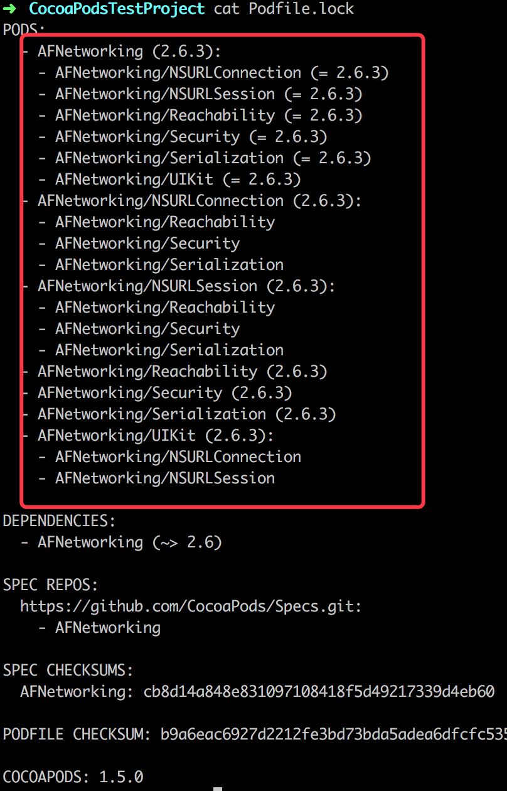
接下来我们通过具体示例来看一下该podfile.lock文件的作用。我们将 `podfile` 中的AFNetworking的版本号给删掉，然后再次进行pod install。此刻并不会安装最新的AF版本，因为在 `podfile.lock` 中已经记录下了当前使用的 `AF` 版本了，所以再次进行 pod install 时仍然会加载 podfile.lock中记录的版本。

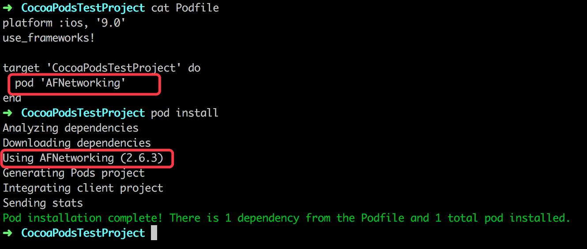
当然你可以使用 `pod update` 命令来进行更新，使 `podfile.lock` 中记录的版本进行更新。当然也可以在 `podfile` 文件中指定相关依赖仓库的版本，然后再执行 `pod install` 来更新相关的版本。具体如下所示 ：

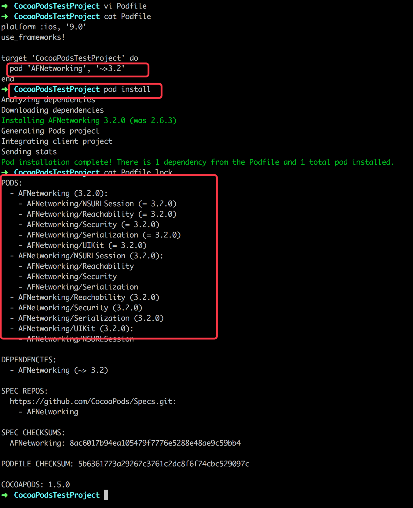
## 四、创建并发布自己的开源库

上面三个部分介绍了如何在自己的项目中安装和使用CocoaPods，接下来这部分就来介绍一下如果将自己的开源的库接入到CocoaPods中，可以让其他人直接在Podfile中直接配置后，pod install就可以使用。下方是这一系列的操作。

### 1、创建自己的开源仓库

下方以Github为例，首先我们在Github上创建了一个新的仓库用来容纳我们要开源的代码。如下所示：

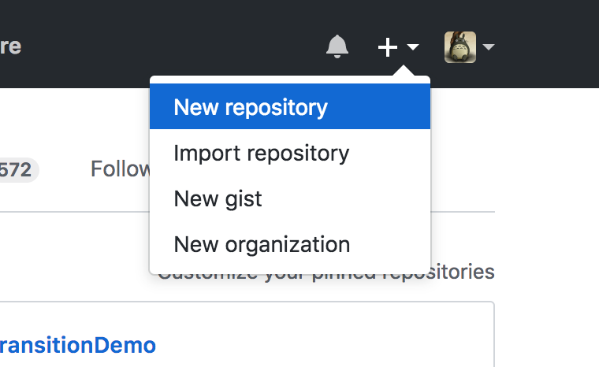
在New Repository时， 选择创建公共仓库，然后勾选上创建README，最后别忘了并选择开源协议。此处我们选择的是MIT协议，下方会对Github上支持的开源协议进行介绍。

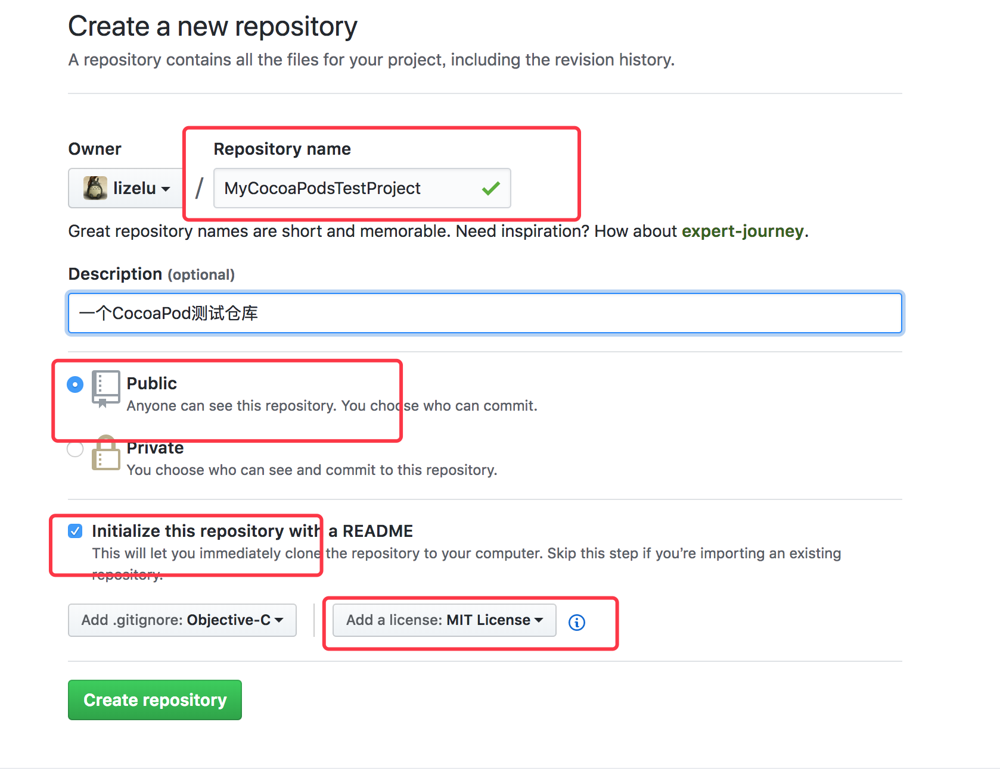
### 2、主流开源协议介绍

Github中支持了主流的几种开源协议，如： **Apache、GPL、MIT、BSD、Mozilla** 等下方罗列了Github上支持的开源协议，具体介绍如下：

* Apache License 2.0 ：Apache Licence是著名的非盈利开源组织Apache采用的协议。简单的说，遵循该协议标志着自己希望自己的专利能在开源免费使用的同时，保留自己在开源产品中的专利权益。同样，该协议要求使用者必须保留你的版权信息。

* MIT License （麻省理工学院许可证） ： 一个简短、宽松、自由的协议。该协议允许人们使用你的代码，但必须要保留你的版权信息。与此同时，并不会给你带来任何责任和风险。

* BSD（Berkly Software Distribution） ： 也是一个比较宽泛自由的协议，该协议允许其他人修改代码，并进行二次发布，并且可以用于商业活动。但是要保留原有代码的BSD协议，并且不能以原作者或者机构的名字来做市场推广。（Unix）

	* BSD 2-Clause "Simplified" License : 简化版本的BSD协议, 修改版本必须保持其原始版权声明。

	* BSD 3-Clause "New" or "Revised" License : 新的或者经过重新修订的BSD协议, 修改版本必须保持其原始版权声明。未经许可不得使用原作者或公司的名字做宣传。

* GPL (GNU General Public License - GNU通用公共许可协议) :  如果你希望别人在分享的自己的作品之后，也必须遵循相同的协议，也必须是开源和免费，那么就选择GPL协议。也就是说只要你用了任何该协议的库、甚至是一段代码，那么你的整个程序，不管以何种方式链接，都必须全部使用GPL协议、并遵循该协议开源。商业软件公司一般禁用GPL代码，但可以使用GPL的可执行文件和应用程序。

	* GNU General Public License v2.0

	* GUN General Public License v3.0

	* GNU Affero General Public License v2.0 : Affero通用公共许可，基于GPL的扩充。即Affero GPL，是GPL的更严格版本。只要你用了任何该协议的库、甚至是一段代码，那么运行时和它相关的所有软件、包括通过网络联系的所有软件，必须全部遵循该协议开源。据律师说，它的要求范围连硬件都包括。所以，一般公司通常禁用任何AGPL代码。

* LGPL : GNU Lesser General Public License - GNU宽松的通用公共许可协议，就是GPL针对动态链接库放松要求了的版本，即允许非LGPL的代码动态链接到LGPL的模块。注意：不可以静态链接，否则你的代码也必须用LGPL协议开源。Mozilla Public License 2.0 : MPL - 修改版本必须保持其原始版权声明。如果发布了编译后的可执行文件，那么必须让对方可以取得MPL协议下程序的源码。

	* GNU Lesser General Public License v2.1

	* GNU Lesser General Public License v3.0

* The Unlicense : 在许多国家，默认版权归作者自动拥有，所以Unlicense协议提供了一种通用的模板，此协议表明你放弃版权，将劳动成果无私贡献出来。你将丧失对作品的全部权利，包括在MIT/X11中定义的无担保权利。

* Eclipse Public License 2.0 : EPL由Eclipse基金会应用于名下的集成开发环境Eclipse上， 商业软件可以使用，也可以修改EPL协议的代码，但要承担代码产生的侵权责任。


### 3、如何去选择你的开源协议

下图是从网上拿过来的，可以根据下方的具体情况来选择相关的开源协议。

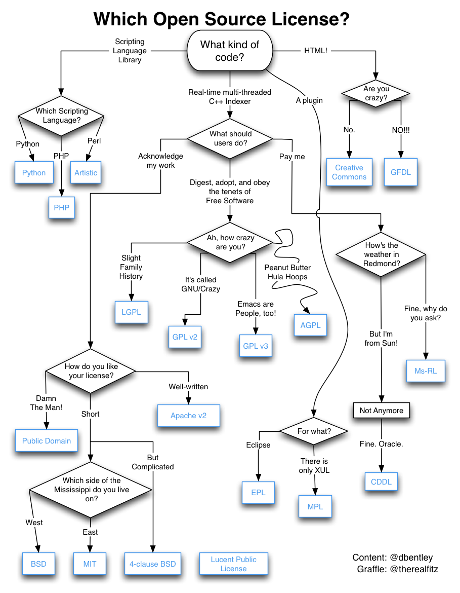
### 4、配置podspec文件并发布自己的源代码

#### (1) 创建 podsepc文件

言归正传，在Github上创建好相关的工程并选好相关的开源协议后，将工程Clone到本地，添加上自己要开源的代码，然后在该工程中创建podspec文件。可以通过 **pod spec create** 命令来创建相关的podsepc文件。

> pod sepc create PodspecFileName  

下方是具体的操作：

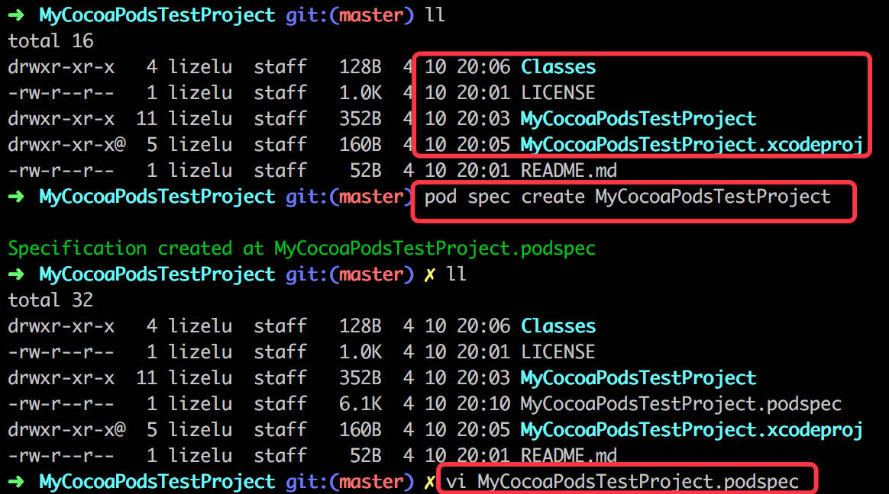
然后对创建好的podspec文件进行编辑，添加上开源库的工程名称、版本、描述、开源协议、作者、平台、源代码等等。具体每项的配置CocoaPods官网上有说明文档，可以去仔细翻阅。

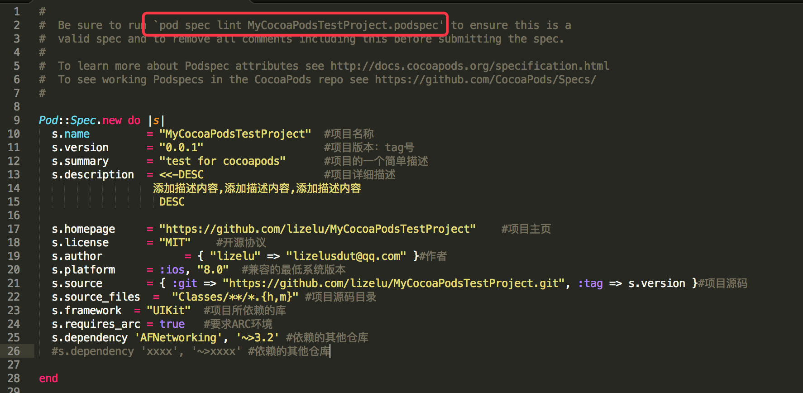
#### (2)、创建tag号并push到远端

配置好podsepc文件后，接着创建一个tag号，这个tag好要与podspec中的version相对应。创建完tag号后，不要忘记push到远端。tag号push到远端后，我们可以通过 **pod spec lint xxxx.podspec** 来测试一下我们配置的podspec是否正确。具体操作如下所示。


#### (3)、测试和创建CocoaPods账号

往CocoaPods上集成开源库，需要相关的CocoaPods账号。我们可以通过 **pod trunk me** 来查看账号是否存在。如果不存在会提示你进行注册并且进行相关认证。下方就使用了一个为注册过的账号进行 trunk。然后进行了相关账号的注册和激活


注册完后，需要进入邮箱进行账号的激活。

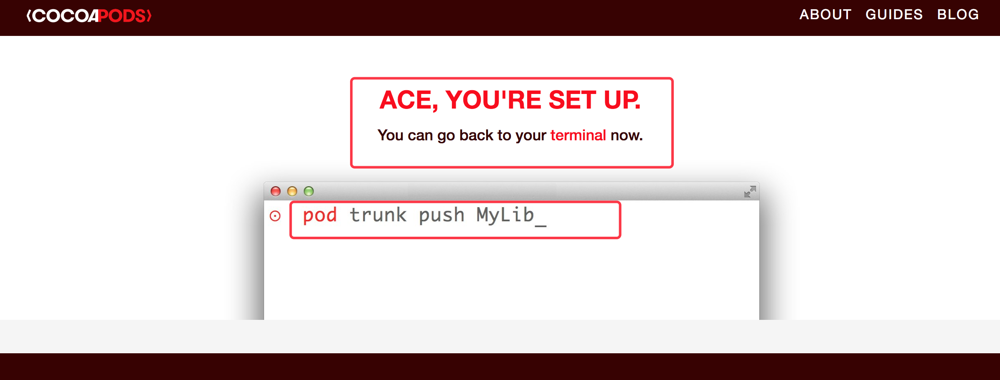
 再次进行 **trunk me** 测试


#### (4)、发布

Git仓库配置已经账号注册完毕后，接下来就开始往CocoaPods上发布自己的仓库了。我们可以通过  **pod trunk push xxxxx.podspce**  将 **podspec文件发布到CocoaPods的Spec仓库中** 。完成这一操作，就完成的我们仓库的发布了。

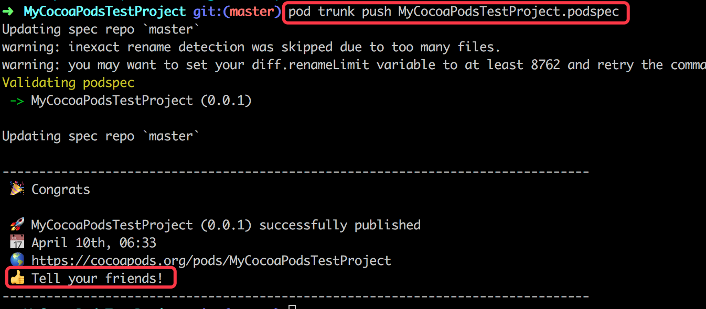
#### 

#### (5)、仓库引用

发布完毕后我们可以通过 pod search 来进行搜索我们发布的库。如下所示，可以正常搜到。发布完毕后我们就可以正常的在Podfile中进行配置、然后 pod install进行安装引用了，具体引用步骤和其他三方库一样，在此就不做过多赘述了。


## 五、CocoaPods的Specs仓库即源码加载路径

接下来我们来看一下CocoaPods的Specs仓库，然后在Specs仓库的基础上在看一下CocoaPods是如何通过我们工程中所提供的Profile文件来加载三方依赖仓库的。

### 1、Specs仓库

上面在发布我们开源代码时页提到过，是将我们创建和配置的xxxx.podspec文件发布到 CocoaPods的Specs仓库（ [https://github.com/CocoaPods/Specs.git](https://github.com/CocoaPods/Specs.git) ）。Specs仓库中就存放着各个开源库的各个版本的podspec文件。

下方就是Github上CocoaPods的Specs仓库。根据该仓库的README中的信息，我们可以看出该仓库中存储的是所有可以用pod 导入的公有仓库的release版本的podspec文件。这些公开的仓库必须遵循MIT协议的。具体如下所示：

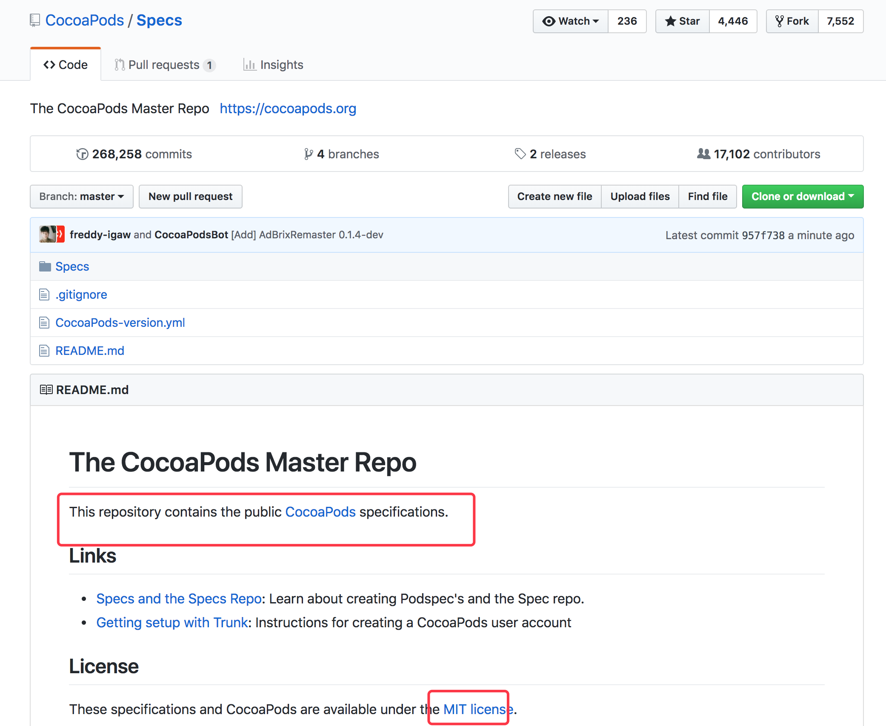
下方就是我们从CocoaPods中的Specs仓库里边找到的上面我们发布的测试工程。在我们工程的文件夹下对应的是一个个版本（git仓库的tag号），每个tag号下方对应的就是该版本的podspec文件。我们在发布我们的工程到CocoaPods的时，本质上是根据我们的工程名称创建相关的文件夹，然后根据我们的tag号创建子文件夹，然后在子文件夹中上传当前版本所对应的podspec文件。

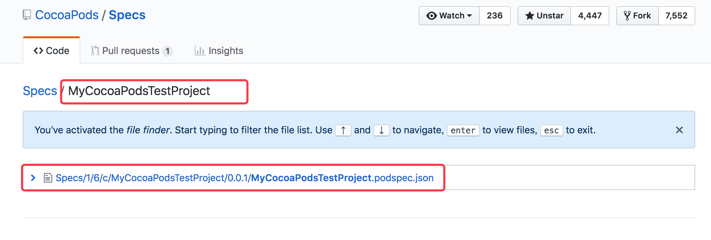
### 2、三方依赖的加载路径

看完Specs仓库里边的内容后，接下来我们来看一下我们CocoaPods是如何通过我们工程中的Podfile文件来加载相关的三方依赖库的。

首先我们来看一下Podfile中的基本结构。在Podfile文件中，其中的 source  参数就是用来指定依赖仓库所对应的Specs仓库的， source的默认地址就是CocoaPods的 Specs 仓库。如果我们有自己的私有 Specs 仓库，也可以指定我们自己的Specs仓库地址。

在Podfile中可以指定多个 Specs 仓库的地址，稍后我们会创建我们自己的Specs仓库，然后在该Specs仓库中上次发布我们自己使用的依赖库。

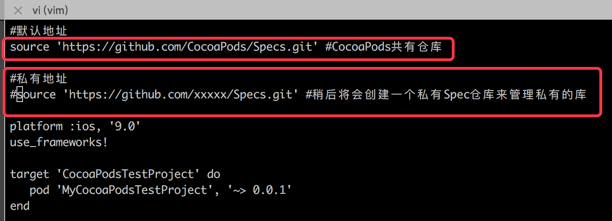
下方是CocoaPods中加载依赖仓库代码的路径，根据自己的理解，寻找源码路径大体上分为下方几个步骤：

* 通过Podfile这个 source 指定的Specs仓库的地址，我们就可以找到相关的Specs仓库。

* 找到Specs仓库后，再根据 Podfile 中所提供的仓库依赖配置（比如 pod 'AFNetWorkiing', ~>'2.6.3'），找到指定的依赖仓库和相关的版本。

* 然后找到该版本所对应的 xxx.podspec 文件。

* 然后再根据 xxx.podsepce 文件中的相关配置信息找到该仓库所对应的源码的git地址。

* 最后根据源码的git地址加载三方仓库到Pods工程中统一管理。

下方是根据上方的步骤所画的简图。CocoaPods真正的工作应该比下方要复杂的多，

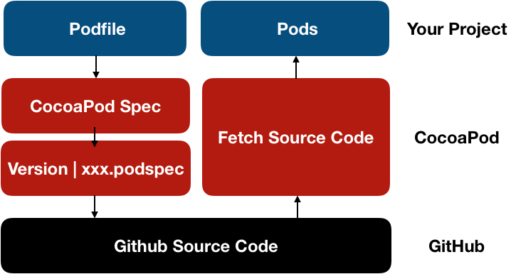
## 六、创建私有的Specs仓库

上面看完 CocoaPods 仓库的 Specs 文件后，接下来我们来看一下如何创建私有的 Specs 仓库。当我们的工程比较大时，尤其是使用模块化开发是，我们的工程会依赖好多其他的仓库。创建私有的Specs仓库来管理私有的依赖仓库是很有必要的。接下来就介绍一下如何创建私有的Sepcs仓库，然后把我们私有的依赖库发布到我们自己的Specs仓库中。

下方以Github为例，会在Github上创建相关的Specs

### 1、创建私有Specs Repo

首先我们需要做的是在Github上创建一个名为Specs的仓库（该仓库的名字可以根据具体情况命名）。然后在本地关联该Specs仓库到Pod的仓库中。

> pod repo add SpecsName SpecsGitAddr  

添加完毕后我们可使用 pod repo 命令来查看该仓库是否正常添加到CocoaPods中。

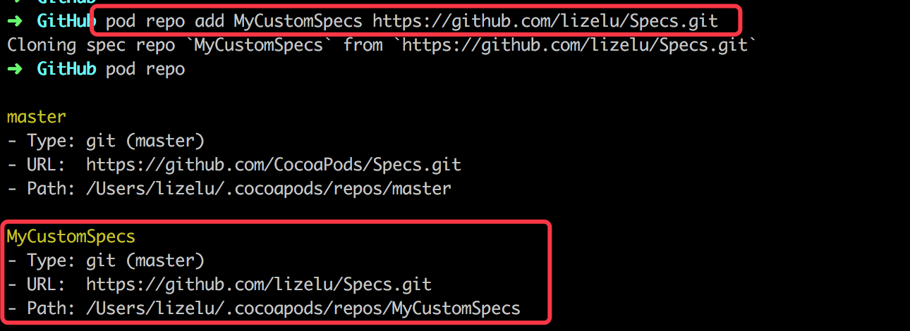
我看可以用下方命令来看一下该Specs仓库是否可用：

> pod repo lint xxxxSpecsName  

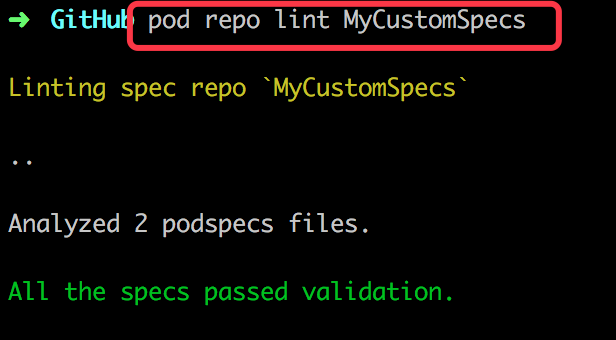
### 2、将私有依赖库工布到自己的Specs仓库中

经过第一步就算创建并关联好了我们私有的Specs仓库了，接下来我们就该将私有的依赖仓库发布到我们自己的Specs仓库中了。这一发布的过程与之前我们将工程发布到CocoaPods的Specs仓库中是一致的。只不过是将CocoaPods的Specs名称换成了上面我们配置的MyCustomSpec名称。具体如下所示：

> pod repo push XxxSpecs xxxx.podspec  

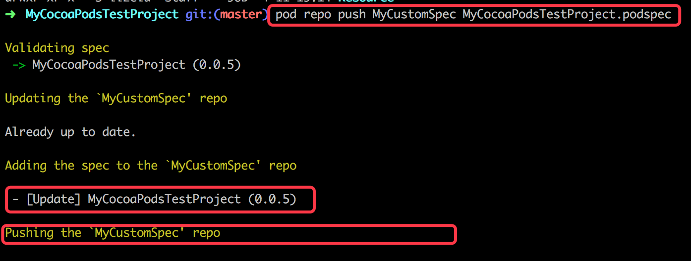
发布完以后，我们可以去本地还有远端的Specs仓库中去查看发布的相关仓库的信息，下方是我们本地的仓库信息。可以看出在push完毕后，在cocoapods的repos文件夹下的MyCustomSpec文件中多了一个MyCocoaPodsTestProject 文件夹，该文件夹下存放的就是该依赖库中的版本信息和各个版本的 podspec 文件。

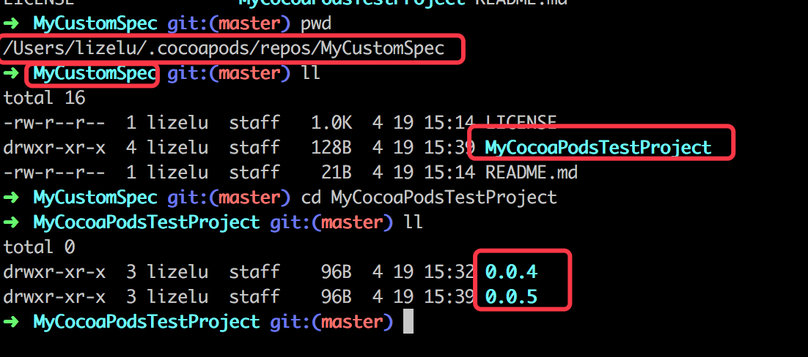
我们也可以从github来查看发布的依赖库的相关信息，如下所示。该结构与CocoaPods的Specs仓库时差不多的。

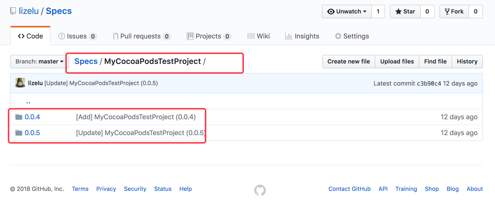
### 3、引入私有仓库

依赖仓库 push 完毕后，接下来就该正常使用相关的依赖仓库了。不过使用时在Podfile中要指定相关Podspec的地址，配置完毕后就可以pod install直接使用了。

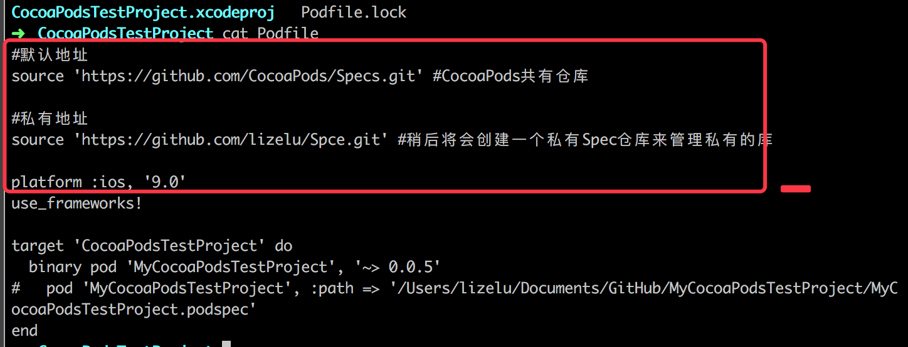
今天博客就先到这儿吧，下篇博客会介绍另一个Cocoa包管理器Carthage。

[Cocoa包管理器之CocoaPods详解 - 青玉伏案 - 博客园](https://www.cnblogs.com/ludashi/p/8778945.html)