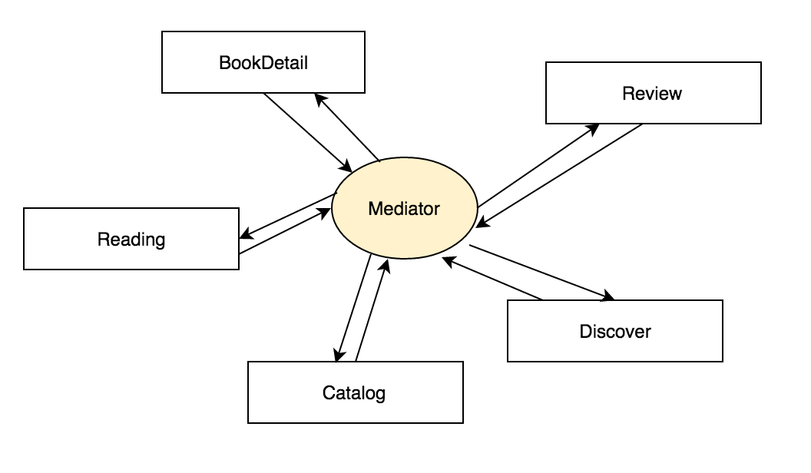
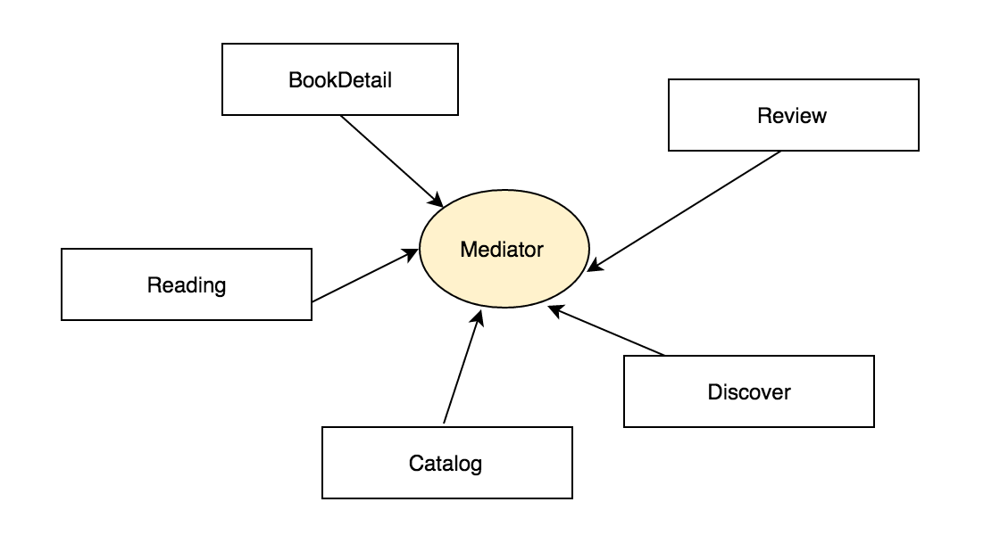

# iOS 组件化方案探索
看了 Limboy( [蘑菇街 App 的组件化之路 - Limboy’s HQ](https://limboy.me/2016/03/10/mgj-components/) 与[蘑菇街 App 的组件化之路·续 - Limboy’s HQ](https://limboy.me/2016/03/14/mgj-components-continued/)) 和 Casa ([iOS应用架构谈 组件化方案 - Casa Taloyum](https://casatwy.com/iOS-Modulization.html)) 对 iOS 组件化方案的讨论，写篇文章梳理下思路。

首先我觉得”组件”在这里不太合适，因为按我理解组件是指比较小的功能块，这些组件不需要多少组件间通信，没什么依赖，也就不需要做什么其他处理，面向对象就能搞定。而这里提到的是较大粒度的业务功能，我们习惯称为”模块”。为了方便表述，下面模块和组件代表同一个意思，都是指较大粒度的业务模块。

一个 APP 有多个模块，模块之间会通信，互相调用，例如微信读书有 书籍详情 想法列表 阅读器 发现卡片 等等模块，这些模块会互相调用，例如 书籍详情要调起阅读器和想法列表，阅读器要调起想法列表和书籍详情，等等，一般我们是怎样调用呢，以阅读器为例，会这样写：

```
#import "WRBookDetailViewController.h"
#import "WRReviewViewController.h"
@implementation WRReadingViewController
- (void)gotoDetail {
 WRBookDetailViewController *detailVC = [[WRBookDetailViewController alloc] initWithBookId:self.bookId];
 [self.navigationController pushViewController:detailVC animated:YES];
}

- (void)gotoReview {
 WRReviewViewController *reviewVC = [[WRReviewViewController alloc] initWithBookId:self.bookId reviewType:1];
 [self.navigationController pushViewController:reviewVC animated:YES];
}
@end
```

看起来挺好，这样做简单明了，没有多余的东西，项目初期推荐这样快速开发，但到了项目越来越庞大，这种方式会有什么问题呢？显而易见，每个模块都离不开其他模块，互相依赖粘在一起成为一坨：

 

 

这样揉成一坨对测试/编译/开发效率/后续扩展都有一些坏处，那怎么解开这一坨呢。很简单，按软件工程的思路，下意识就会加一个中间层：

 

 

叫他 Mediator Manager Router 什么都行，反正就是负责转发信息的中间层，暂且叫他 Mediator。

看起来顺眼多了，但这里有几个问题：

1. Mediator 怎么去转发组件间调用？
2. 一个模块只跟 Mediator 通信，怎么知道另一个模块提供了什么接口？
3. 按上图的画法，模块和 Mediator 间互相依赖，怎样破除这个依赖？

## 方案1

对于前两个问题，最直接的反应就是在 Mediator 直接提供接口，调用对应模块的方法：

```
//Mediator.m
#import "BookDetailComponent.h"
#import "ReviewComponent.h"
@implementation Mediator
+ (UIViewController *)BookDetailComponent_viewController:(NSString *)bookId {
 return [BookDetailComponent detailViewController:bookId];
}
+ (UIViewController *)ReviewComponent_viewController:(NSString *)bookId reviewType:(NSInteger)type {
 return [ReviewComponent reviewViewController:bookId type:type];
}
@end
```

```
//BookDetailComponent 组件
#import "Mediator.h"
#import "WRBookDetailViewController.h"
@implementation BookDetailComponent
+ (UIViewController *)detailViewController:(NSString *)bookId {
 WRBookDetailViewController *detailVC = [[WRBookDetailViewController alloc] initWithBookId:bookId];
 return detailVC;
}
@end
```

```
//ReviewComponent 组件
#import "Mediator.h"
#import "WRReviewViewController.h"
@implementation ReviewComponent
+ (UIViewController *)reviewViewController:(NSString *)bookId type:(NSInteger)type {
 UIViewController *reviewVC = [[WRReviewViewController alloc] initWithBookId:bookId type:type];
 return reviewVC;
}
@end
```

然后在阅读模块里：

```
//WRReadingViewController.m
#import "Mediator.h"
@implementation WRReadingViewController
- (void)gotoDetail:(NSString *)bookId {
 UIViewController *detailVC = [Mediator BookDetailComponent_viewControllerForDetail:bookId];
 [self.navigationController pushViewController:detailVC];

 UIViewController *reviewVC = [Mediator ReviewComponent_viewController:bookId type:1];
 [self.navigationController pushViewController:reviewVC];
}
@end
```

这就是一开始架构图的实现，看起来显然这样做并没有什么好处，依赖关系并没有解除，Mediator 依赖了所有模块，而调用者又依赖 Mediator，最后还是一坨互相依赖，跟原来没有 Mediator 的方案相比除了更麻烦点其他没区别。

那怎么办呢。

怎样让Mediator解除对各个组件的依赖，同时又能调到各个组件暴露出来的方法？对于OC有一个法宝可以做到，就是runtime反射调用：

```
//Mediator.m
@implementation Mediator
+ (UIViewController *)BookDetailComponent_viewController:(NSString *)bookId {
 Class cls = NSClassFromString(@"BookDetailComponent");
 return [cls performSelector:NSSelectorFromString(@"detailViewController:") withObject:@{@"bookId":bookId}];
}
+ (UIViewController *)ReviewComponent_viewController:(NSString *)bookId type:(NSInteger)type {
 Class cls = NSClassFromString(@"ReviewComponent");
 return [cls performSelector:NSSelectorFromString(@"reviewViewController:") withObject:@{@"bookId":bookId, @"type": @(type)}];
}
@end
```

这下 Mediator 没有再对各个组件有依赖了，你看已经不需要 ＃import 什么东西了，对应的架构图就变成：

 

 

只有调用其他组件接口时才需要依赖 Mediator，组件开发者不需要知道 Mediator 的存在。

等等，既然用runtime就可以解耦取消依赖，那还要Mediator做什么？组件间调用时直接用runtime接口调不就行了，这样就可以没有任何依赖就完成调用：

```
//WRReadingViewController.m
@implementation WRReadingViewController
- (void)gotoReview:(NSString *)bookId {
 Class cls = NSClassFromString(@"ReviewComponent");
 UIViewController *reviewVC = [cls performSelector:NSSelectorFromString(@"reviewViewController:") withObject:@{@"bookId":bookId, @"type": @(1)}];
 [self.navigationController pushViewController:reviewVC];
}
@end
```

这样就完全解耦了，但这样做的问题是：

1. 调用者写起来很恶心，代码提示都没有，每次调用写一坨。
2. runtime方法的参数个数和类型限制，导致只能每个接口都统一传一个 NSDictionary。这个 NSDictionary里的key value是什么不明确，需要找个地方写文档说明和查看。
3. 编译器层面不依赖其他组件，实际上还是依赖了，直接在这里调用，没有引入调用的组件时就挂了

把它移到Mediator后：

1. 调用者写起来不恶心，代码提示也有了。
2. 参数类型和个数无限制，由 Mediator 去转就行了，组件提供的还是一个 NSDictionary 参数的接口，但在Mediator 里可以提供任意类型和个数的参数，像上面的例子显式要求参数 NSString *bookId 和 NSInteger type。
3. Mediator可以做统一处理，调用某个组件方法时如果某个组件不存在，可以做相应操作，让调用者与组件间没有耦合。

到这里，基本上能解决我们的问题：各组件互不依赖，组件间调用只依赖中间件Mediator，Mediator不依赖其他组件。接下来就是优化这套写法，有两个优化点：

1. Mediator 每一个方法里都要写 runtime 方法，格式是确定的，这是可以抽取出来的。
2. 每个组件对外方法都要在 Mediator 写一遍，组件一多 Mediator 类的长度是恐怖的。

优化后就成了 casa 的方案，target-action 对应第一点，target就是class，action就是selector，通过一些规则简化动态调用。Category 对应第二点，每个组件写一个 Mediator 的 Category，让 Mediator 不至于太长。这里有个 [demo](https://github.com/casatwy/CTMediator)

总结起来就是，组件通过中间件通信，中间件通过 runtime 接口解耦，通过 target-action 简化写法，通过 category 感官上分离组件接口代码。

## 方案2

回到 Mediator 最初的三个问题，蘑菇街用的是另一种方式解决：注册表的方式，用URL表示接口，在模块启动时注册模块提供的接口，一个简化的实现：

```
//Mediator.m 中间件
@implementation Mediator
typedef void (^componentBlock) (id param);
@property (nonatomic, storng) NSMutableDictionary *cache
- (void)registerURLPattern:(NSString *)urlPattern toHandler:(componentBlock)blk {
 [cache setObject:blk forKey:urlPattern];
}

- (void)openURL:(NSString *)url withParam:(id)param {
 componentBlock blk = [cache objectForKey:url];
 if (blk) blk(param);
}
@end
```

```
//BookDetailComponent 组件
#import "Mediator.h"
#import "WRBookDetailViewController.h"
+ (void)initComponent {
 [[Mediator sharedInstance] registerURLPattern:@"weread://bookDetail" toHandler:^(NSDictionary *param) {
 WRBookDetailViewController *detailVC = [[WRBookDetailViewController alloc] initWithBookId:param[@"bookId"]];
 [[UIApplication sharedApplication].keyWindow.rootViewController.navigationController pushViewController:detailVC animated:YES];
 }];
}
```

```
//WRReadingViewController.m 调用者
//ReadingViewController.m
#import "Mediator.h"

+ (void)gotoDetail:(NSString *)bookId {
 [[Mediator sharedInstance] openURL:@"weread://bookDetail" withParam:@{@"bookId": bookId}];
}
```

这样同样做到每个模块间没有依赖，Mediator 也不依赖其他组件，不过这里不一样的一点是组件本身和调用者都依赖了Mediator，不过这不是重点，架构图还是跟方案1一样。

各个组件初始化时向 Mediator 注册对外提供的接口，Mediator 通过保存在内存的表去知道有哪些模块哪些接口，接口的形式是 URL->block。

这里抛开URL的远程调用和本地调用混在一起导致的问题，先说只用于本地调用的情况，对于本地调用，URL只是一个表示组件的key，没有其他作用，这样做有三个问题：

1. 需要有个地方列出各个组件里有什么 URL 接口可供调用。蘑菇街做了个后台专门管理。
2. 每个组件都需要初始化，内存里需要保存一份表，组件多了会有内存问题。
3. 参数的格式不明确，是个灵活的 dictionary，也需要有个地方可以查参数格式。

第二点没法解决，第一点和第三点可以跟前面那个方案一样，在 Mediator 每个组件暴露方法的转接口，然后使用起来就跟前面那种方式一样了。

抛开URL不说，这种方案跟方案1的共同思路就是：Mediator 不能直接去调用组件的方法，因为这样会产生依赖，那我就要通过其他方法去调用，也就是通过 字符串->方法 的映射去调用。runtime 接口的 className + selectorName -> IMP 是一种，注册表的 key -> block 是一种，而前一种是 OC 自带的特性，后一种需要内存维持一份注册表，这是不必要的。

现在说回 URL，组件化是不应该跟 URL 扯上关系的，因为组件对外提供的接口主要是模块间代码层面上的调用，我们先称为本地调用，而 URL 主要用于 APP 间通信，姑且称为远程调用。按常规思路者应该是对于远程调用，再加个中间层转发到本地调用，让这两者分开。那这里这两者混在一起有什么问题呢？

如果是 URL 的形式，那组件对外提供接口时就要同时考虑本地调用和远程调用两种情况，而远程调用有个限制，传递的参数类型有限制，只能传能被字符串化的数据，或者说只能传能被转成 json 的数据，像 UIImage 这类对象是不行的，所以如果组件接口要考虑远程调用，这里的参数就不能是这类非常规对象，接口的定义就受限了。

用理论的话来说就是，远程调用是本地调用的子集，这里混在一起导致组件只能提供子集功能，无法提供像方案1那样提供全集功能。所以这个方案是天生有缺陷的，对于遗漏的这部分功能，蘑菇街使用了另一种方案补全，请看方案3。

## 方案3

蘑菇街为了补全本地调用的功能，为组件多加了另一种方案，就是通过 protocol-class 注册表的方式。首先有一个新的中间件：

```
//ProtocolMediator.m 新中间件
@implementation ProtocolMediator
@property (nonatomic, storng) NSMutableDictionary *protocolCache
- (void)registerProtocol:(Protocol *)proto forClass:(Class)cls {
 NSMutableDictionary *protocolCache;
 [protocolCache setObject:cls forKey:NSStringFromProtocol(proto)];
}

- (Class)classForProtocol:(Protocol *)proto {
 return protocolCache[NSStringFromProtocol(proto)];
}
@end
```

然后有一个公共Protocol文件，定义了每一个组件对外提供的接口：

```
//ComponentProtocol.h
@protocol BookDetailComponentProtocol <NSObject>
- (UIViewController *)bookDetailController:(NSString *)bookId;
- (UIImage *)coverImageWithBookId:(NSString *)bookId;
@end

@protocol ReviewComponentProtocol <NSObject>
- (UIViewController *)ReviewController:(NSString *)bookId;
@end
```

再在模块里实现这些接口，并在初始化时调用 registerProtocol 注册。

```
//BookDetailComponent 组件
#import "ProtocolMediator.h"
#import "ComponentProtocol.h"
#import "WRBookDetailViewController.h"
+ (void)initComponent
{
 [[ProtocolMediator sharedInstance] registerProtocol:@protocol(BookDetailComponentProtocol) forClass:[self class];
}

- (UIViewController *)bookDetailController:(NSString *)bookId {
 WRBookDetailViewController *detailVC = [[WRBookDetailViewController alloc] initWithBookId:param[@"bookId"]];
 return detailVC;
}

- (UIImage *)coverImageWithBookId:(NSString *)bookId {
 ….
}
```

最后调用者通过 protocol 从 ProtocolMediator 拿到提供这些方法的 Class，再进行调用：

```
//WRReadingViewController.m 调用者
//ReadingViewController.m
#import "ProtocolMediator.h"
#import "ComponentProtocol.h"
+ (void)gotoDetail:(NSString *)bookId {
 Class cls = [[ProtocolMediator sharedInstance] classForProtocol:BookDetailComponentProtocol];
 id bookDetailComponent = [[cls alloc] init];
 UIViewController *vc = [bookDetailComponent bookDetailController:bookId];
 [[UIApplication sharedApplication].keyWindow.rootViewController.navigationController pushViewController:vc animated:YES];
}
```

这种思路有点绕，这个方案跟刚才两个最大的不同就是，它不是直接通过 Mediator 调用组件方法，而是通过 Mediator 拿到组件对象，再自行去调用组件方法。

结果就是组件方法的调用是分散在各地的，没有统一的入口，也就没法做组件不存在时的统一处理。组件1调用了组件2的方法，如果用前面两种方式，组件间是没有依赖的，组件1+Mediator可以单独抽离出来，只需要在Mediator里做好调用组件2方法时的异常处理就行。而这种方法组件1对组件2的调用分散在各个地方，没法做这些处理，在不修改组件1代码的情况下，组件1和组件2是分不开的。

当然你也可以在这上面跟方案1一样在 Mediator 对每一个组件接口 wrapper 一层，那这样这种方案跟方案1比除了更复杂点，其他没什么区别。

在 protocol-class 这个方案上，主要存在的问题就是分散调用导致耦合，另外实现上会有一些绕，其他就没什么了。casa 说的 “protocol对业务产生了侵入，且不符合黑盒模型。” 其实并没有这么夸张，实际上 protocol 对外提供组件方法，跟方案1在 Mediator wrapper 对外提供组件方法是差不多的。

## 最后

蘑菇街在一个项目里同时用了方案2和方案3两种方式，会让写组件的人不知所措，新增一个接口时不知道该用方案2的方式还是方案3的方式，可能这个在蘑菇街内部会通过一些文档规则去规范，但其实是没有必要的。可能是蘑菇街作为电商平台一开始就注重APP页面间跳转的概念，每个模块已经有一个对应的URL，于是组件化时自然想到通过URL的方式表示组件，后续发现URL方式的限制，于是加上方案3的方式，这也是正常的探索过程。

上面论述下方案1确实比方案2+方案3简单明了，没有 注册表常驻内存/参数传递限制/调用分散 这些缺点，方案1多做的一步是需要对所有组件方法进行一层 wrapper，但若想要明确提供组件的方法和参数类型，解耦统一处理，方案2和方案3同样需要多加这层。

实际上我没有组件化相关的实践，这里仅从 limboy 和 casa 提供的这几个方案对比分析，我还对组件化带来的收益是否大于组件化增加的成本这点存疑，相信真正实践起来还会碰到很多坑，继续探索中。

## reference

[iOS 组件化方案探索 2016-3-18](http://blog.cnbang.net/tech/3080/)
