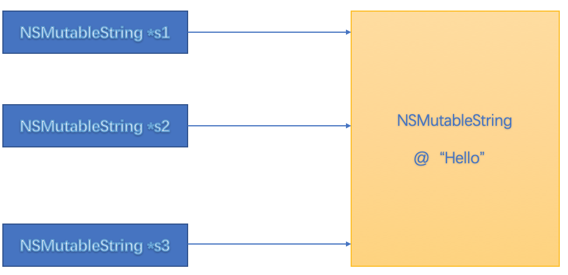
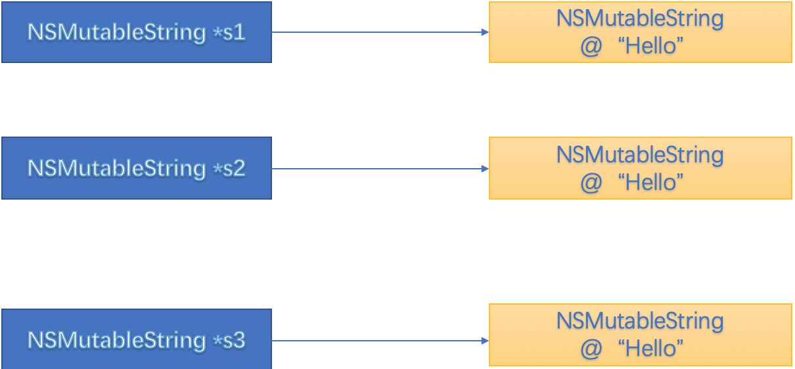
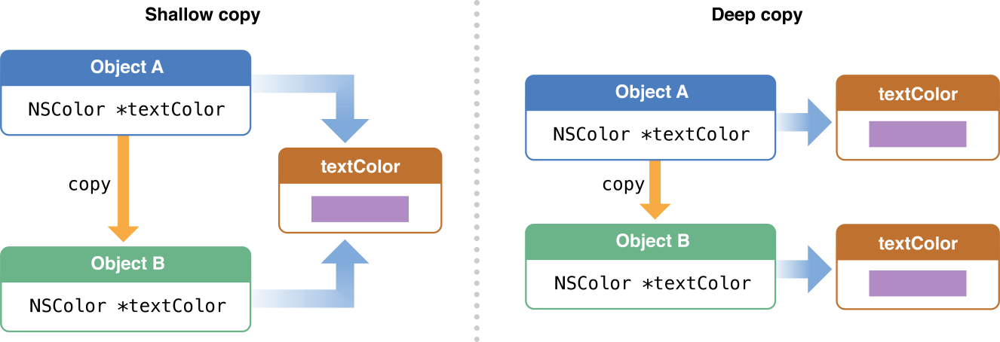

#NSCopying、NSMutableCopying

## 为什么要使用copy？

OC中有指针的概念，当多个指针指向同一个对象时，只要任意一个指针修改了指向的对象，其他指针访问的都是修改后的对象。

如图：



如果s1修改调用appdingString修改了对象，s2,s3的读取的值将都发生变化，如果我们不希望s1的修改对s2和s3造成影响，我们就需要复制对象。



调用copy方法就是为了实现这个目的。

block的copy操作是为了将NSStackBlock由栈空间复制到堆空间变成NSMallocBlock，防止提前释放，无法调用引起崩溃。

## 如何实现copy

如果类想要支持copy操作，则必须实现NSCopying协议，也就是说实现copyWithZone方法。

如果类想要支持copy操作，则必须实现NSCopying协议，也就是说实现copyWithZone方法。

iOS系统中的一些类已经实现了NSCopying或者NSMutableCopying协议的方法，如果向未实现相应方法的系统类或者自定义类发送copy或者mutableCopy消息，则会crash。

```
*** Terminating app due to uncaught exception 'NSInvalidArgumentException', reason: '-[Person copyWithZone:]: unrecognized selector sent to instance 0x6080000314c0'
```
发送copy和mutableCopy消息，均是进行拷贝操作，但是对不可变对象的非容器类、可变对象的非容器类、可变对象的容器类、不可变对象的容器类中复制的方式略有不同。但如下两点是相同的：

* 发送copy消息，拷贝出来的是不可变对象;

* 发送mutableCopy消息，拷贝出来的是可变对象;

故如下的操作会导致crash

```
NSMutableString *test1 = [[NSMutableString alloc]initWithString:@"11111"];
NSMutableString *test2 = [test1 copy];
[test2 appendString:@"22222"];
```
```
*** Terminating app due to uncaught exception 'NSInvalidArgumentException', reason: '-[NSTaggedPointerString appendString:]: unrecognized selector sent to
```

## 浅拷贝与深拷贝

通过上面可知，对一个对象进行copy操作，就是为了复制出来一份，但是有些对象是不可修改，所以复制一份没有意义。编译器做了优化，对不可变的对象进行copy，仍返回原对象。这里就引出了深拷贝和浅拷贝的概念。

下面我们以 Apple 官方文档中的图片进行说明：



对Object A对象进行copy操作，生成了Object B对象时，如果Object B对象的属性textColor只是进行指针复制，则为浅拷贝，如果textColor不仅进行了指针复制，指针所指对象也进行了复制，则为深拷贝。

对应集合如下图


浅复制是指针拷贝；深复制是内容拷贝，会拷贝对象本身

## Copy 与 MutableCopy

在iOS中，有一些系统类根据是否可变进行了区分，例如 NSString 与 NSMutableString，NSArray 与 NSMutableArray 等。copy和mutablecopy就是为了根据需要复制出可变和不可变的对象。可以分为如下四种情况：

* 不可变对象调用copy，为进行内容复制，为浅拷贝
* 不可变对象调用mutableCopy，生成新对象，为深拷贝
* 可变对象调用copy，生成新对象，为深拷贝
* 可变对象调用mutableCop，生成新对象，为深拷贝

## 系统非容器类的copy

系统提供的非容器类中，如NSString,NSMutableString，有如下特性：

* 向不可变对象发送copy，是浅拷贝；向不可变对象发送mutalbeCopy消息，是深拷贝；

```
NSString *s1 = @"123";
NSString *s2 = [s1 copy];
NSMutableString *ms3 = [s1 mutableCopy];

NSLog(@"s1指针的地址：%p，s1所指对象的地址：%p",&s1, s1);
NSLog(@"s2指针的地址：%p，s2所指对象的地址：%p",&s2, s2);
NSLog(@"ms3指针的地址：%p，ms3所指对象的地址：%p",&ms3, ms3);

s1指针的地址：0x7ffeefbff4e8，s1所指对象的地址：0x100002098
s2指针的地址：0x7ffeefbff4e0，s2所指对象的地址：0x100002098
ms3指针的地址：0x7ffeefbff4d8，ms3所指对象的地址：0x102858240
```

* 向可变对象发送copy和mutableCopy消息，均是深拷贝

```
NSMutableString *ms4 = [NSMutableString stringWithString:@"123"];
NSString *s5 = [ms4 copy];
NSMutableString *ms6 = [ms4 mutableCopy];

NSLog(@"ms4指针的地址：%p，ms4所指对象的地址：%p",&ms4, ms4);
NSLog(@"s5指针的地址：%p，s5所指对象的地址：%p",&s5, s5);
NSLog(@"ms6指针的地址：%p，ms6所指对象的地址：%p",&ms6, ms6);

ms4指针的地址：0x7ffeefbff4d0，ms4所指对象的地址：0x100615d60
s5指针的地址：0x7ffeefbff4c8，s5所指对象的地址：0x88ce4b7032c9108f
ms6指针的地址：0x7ffeefbff4c0，ms6所指对象的地址：0x100616090
```

## 3、系统容器类

系统提供的容器类中，如NSArray,NSDictionary，有如下特性：

* 不可变对象copy，是浅拷贝

```
NSMutableString *s = [NSMutableString stringWithString:@"hello"];
NSArray *arr1 = [NSArray arrayWithObject:s];
NSArray *arr2 = [arr1 copy];

[s appendString:@" giao"];

NSLog(@"arr1 = %p, arr2 = %p",arr1, arr2);


NSString *s1 = arr1.firstObject;
NSString *s2 = arr2.firstObject;

NSLog(@"s = %p, s1 = %p, s2 = %p",s, s1, s2);

NSLog(@"arr1 = %@",arr1);
NSLog(@"arr2 = %@",arr2);
        
```

```
2020-10-17 19:55:54.038087+0800 Copy[53643:8222942] arr1 = 0x1005364f0, arr2 = 0x1005364f0
2020-10-17 19:55:54.038876+0800 Copy[53643:8222942] s = 0x100534760, s1 = 0x100534760, s2 = 0x100534760
2020-10-17 19:55:54.039088+0800 Copy[53643:8222942] arr1 = (
    "hello giao"
)
2020-10-17 19:55:54.039342+0800 Copy[53643:8222942] arr2 = (
    "hello giao"
)
```

* 不可变对象mutableCopy，单层深拷贝

```
NSMutableString *s = [NSMutableString stringWithString:@"hello"];
NSArray *arr1 = [NSArray arrayWithObject:s];
NSArray *arr2 = [arr1 mutableCopy];

[s appendString:@" giao"];

NSLog(@"arr1 = %p, arr2 = %p",arr1, arr2);


NSString *s1 = arr1.firstObject;
NSString *s2 = arr2.firstObject;

NSLog(@"s = %p, s1 = %p, s2 = %p",s, s1, s2);

NSLog(@"arr1 = %@",arr1);
NSLog(@"arr2 = %@",arr2);
```

```
2020-10-17 20:02:07.011806+0800 Copy[54194:8230946] arr1 = 0x100767940, arr2 = 0x100765cc0
2020-10-17 20:02:07.012414+0800 Copy[54194:8230946] s = 0x100765b20, s1 = 0x100765b20, s2 = 0x100765b20
2020-10-17 20:02:07.012613+0800 Copy[54194:8230946] arr1 = (
    "hello giao"
)
2020-10-17 20:02:07.012746+0800 Copy[54194:8230946] arr2 = (
    "hello giao"
)
```

* 可变对象copy和mutableCopy均是单层深拷贝，也就是说单层的内容拷贝。

arr2的深拷贝arr1开辟了新的内存，但是里面值得内存地址还和arr1共享一份地址，明显就是指针拷贝，所以说这不是完全意义上的深拷贝，叫单层深拷贝！

**那么如何实现完全深拷贝呢?**

```
NSMutableString *s = [NSMutableString stringWithString:@"hello"];
NSMutableArray *arr1 = [NSMutableArray arrayWithObject:s];
NSMutableArray *arr2 = [[NSMutableArray alloc] initWithArray:arr1 copyItems:YES];

[s appendString:@" giao"];

NSLog(@"arr1 = %p, arr2 = %p",arr1, arr2);


NSString *s1 = arr1.firstObject;
NSString *s2 = arr2.firstObject;

NSLog(@"s = %p, s1 = %p, s2 = %p",s, s1, s2);

NSLog(@"arr1 = %@",arr1);
NSLog(@"arr2 = %@",arr2);
```

```
2020-10-17 20:18:08.154212+0800 Copy[55497:8251772] arr1 = 0x10061feb0, arr2 = 0x1006201a0
2020-10-17 20:18:08.154994+0800 Copy[55497:8251772] s = 0x1007185e0, s1 = 0x1007185e0, s2 = 0x6f68308571341739
2020-10-17 20:18:08.155380+0800 Copy[55497:8251772] arr1 = (
    "hello giao"
)
2020-10-17 20:18:08.155528+0800 Copy[55497:8251772] arr2 = (
    hello
)
```

`NSMutableArray *arr2 = [[NSMutableArray alloc] initWithArray:arr1 copyItems:YES];`能实现完全深拷贝。

如何是集合多层嵌套集合，可以使用归档。可以先通过 NSKeyedArchiver 将对象归档，再通过 NSKeyedUnarchiver 将对象解归档。由于在归档时，对象中每个成员变量都会收到 encodeWithCoder: 消息，相当于将对象所有的数据均序列化保存到磁盘上（可以看成换了种数据格式的拷贝），再通过 initWithCoder: 解归档时，就将拷贝过的数据经过转换后读取出来，深拷贝。


## 自定义的类的copy

**重要说明：**

1. 所以的代码设计均是针对业务需求。

2. 对于自定义的类，决定能否向对象发送copy和mutableCopy消息也是如此；

### 1、@property 声明中用 copy 修饰

不得不说下copy和strong在复制时候的区别，此处不讲引用计数的问题。

copy：拷贝一份不可变副本赋值给属性；所以当原对象值变化时，属性值不会变化；

strong：有可能指向一个可变对象,如果这个可变对象在外部被修改了,那么会影响该属性；

```
@interface Person : NSObject 
@property (nonatomic, copy) NSString *familyname;
@property (nonatomic, strong) NSString *nickname;
@end
Person *p1 = [[Person alloc]init];
 
NSMutableString *familyname = [[NSMutableString alloc]initWithString:@"张三"];
p1.familyname = familyname;
[familyname appendString:@"峰"];
 
NSLog(@"p1.familyname is %@",p1.familyname);
 
NSMutableString *nickname = [[NSMutableString alloc]initWithString:@"二狗"];
p1.nickname = nickname;
[nickname appendString:@"蛋儿"];
 
NSLog(@"p1.nickname is %@", p1.nickname);
2017-02-22 13:53:58.979 test[98299:3978965] p1.familyname is 张三
2017-02-22 13:53:58.979 test[98299:3978965] p1.nickname is 二狗蛋儿
```

### 2、类的对象的copy

此处唯一需要说明的一点就是注意类的继承，需复制父类的信息。

1. 类直接继承自NSObject，无需调用[super copyWithZone:zone]
2. 父类实现了copy协议，子类也实现了copy协议，子类需要调用[super copyWithZone:zone]
3. 父类没有实现copy协议，子类实现了copy协议，子类无需调用[super copyWithZone:zone]
4. copyWithZone方法中要调用[[[self class] allocWithZone:zone] init]来分配内存

### 3、NSCopying

NSCopying是对象拷贝的协议。

类的对象如果支持拷贝，该类应遵守并实现NSCopying协议。

```
NSCopying协议中的方法只有一个，如下：
- (id)copyWithZone:(NSZone *)zone { 
 Person *model = [[[self class] allocWithZone:zone] init];
 model.firstName = self.firstName;
 model.lastName = self.lastName;
 //如果lastName为strong类型则model.lastName = [_lastName copy];
 return model;
}
```

官方文档中说[NSObject](https://developer.apple.com/documentation/objectivec/nsobject?language=objc) zone is nil，通过验证，自定义对象调用copy方法后，会调用`- (id)copyWithZone:(nullable NSZone *)zone`传的zone为`NULL`所以使用allocWithZone和alloc等价。

如果自定义类中用到了集合，注意要进行完全深拷贝。

### 4、NSMutableCopying

当自定义的类有一个属性是可变对象时，对此属性复制时要执行mutableCopyWithZone操作。

```
- (id)copyWithZone:(NSZone *)zone {
 AFHTTPRequestSerializer *serializer = [[[self class] allocWithZone:zone] init];
 serializer.mutableHTTPRequestHeaders = [self.mutableHTTPRequestHeaders mutableCopyWithZone:zone];
 serializer.queryStringSerializationStyle = self.queryStringSerializationStyle;
 serializer.queryStringSerialization = self.queryStringSerialization;
 
 return serializer;
}
```

这条有疑问。实在是想不出什么需求需要一个自定义的可变对象。mutableHTTPRequestHeaders这种可变集合需要完全深拷贝，应该调用`- (instancetype)initWithDictionary:(NSDictionary<KeyType, ObjectType> *)otherDictionary copyItems:(BOOL)flag;`方法，或者使用归档。但AFN中确实这么写，会出现上面系统集合调用了copy，但是value还是被修改的情况。