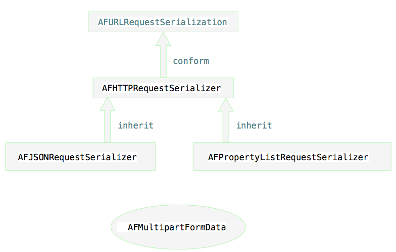

# AFNetworking源码探究（十五） —— 请求序列化之架构分析（一）

## 回顾

上一篇介绍了 `AFSecurityPolicy` 与安全认证，这一篇我们看一下请求参数的序列化问题，对应的都在文件 `AFURLRequestSerialization` 中，下面我们就开始了。

## 请求序列化中的类和协议

下面我们就看一下请求序列化中的类和协议。

* `@protocol AFURLRequestSerialization <NSObject, NSSecureCoding, NSCopying>`
* `@interface AFHTTPRequestSerializer : NSObject <AFURLRequestSerialization>`
* `@protocol AFMultipartFormData`
* `@interface AFJSONRequestSerializer : AFHTTPRequestSerializer`
* `@interface AFPropertyListRequestSerializer : AFHTTPRequestSerializer`

这里是一个父类，两个子类，父类遵循了一个协议，还有另外一个单独的协议，它们之间的关系可以参考下图。



上面这个图是我画的，应该很清楚他们之间的关系了吧。

## 请求序列化的架构

大家还记得前面几篇写的response数据解析的结构吗？其实这里request数据解析的架构是一样的，都是父类和子类均实现 `AFURLRequestSerialization` 这个协议，实现了请求的序列化。

```
/**
 The `AFURLRequestSerialization` protocol is adopted by an object that encodes parameters for a specified HTTP requests. Request serializers may encode parameters as query strings, HTTP bodies, setting the appropriate HTTP header fields as necessary.

 For example, a JSON request serializer may set the HTTP body of the request to a JSON representation, and set the `Content-Type` HTTP header field value to `application/json`.
 */
@protocol AFURLRequestSerialization <NSObject, NSSecureCoding, NSCopying>

/**
 Returns a request with the specified parameters encoded into a copy of the original request.

 @param request The original request.
 @param parameters The parameters to be encoded.
 @param error The error that occurred while attempting to encode the request parameters.

 @return A serialized request.
 */
- (nullable NSURLRequest *)requestBySerializingRequest:(NSURLRequest *)request
                               withParameters:(nullable id)parameters
                                        error:(NSError * _Nullable __autoreleasing *)error NS_SWIFT_NOTHROW;

@end
```

`AFURLRequestSerialization` 协议被一个对象所采用，该对象为指定的HTTP请求编码参数。 请求序列化器可以将参数编码为查询字符串，HTTP主体，根据需要设置适当的HTTP头字段。

例如，JSON请求序列化器可以将请求的HTTP主体设置为JSON表示，并将 `Content-Type` HTTP标头字段值设置为 `application / json` 。

从这就能看出，AFN这个框架的设计架构和思想都是非常好，值得我们去学习的。

## 后记

> 本篇对请求序列化的类、协议以及架构进行了分析，下一篇将对序列化的流程进行分析，喜欢的就给个关注和赞~~  

[AFNetworking源码探究（十五） —— 请求序列化之架构分析（一）](https://www.jianshu.com/p/4373cebdd79c)