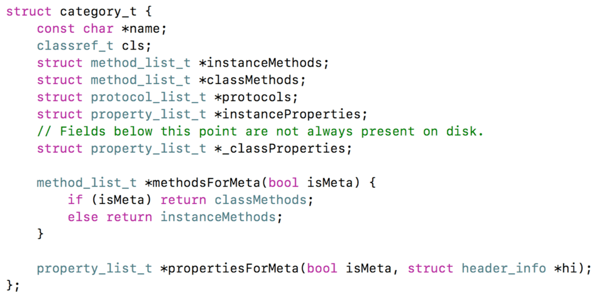

# 5、Category

## 5.1 Category的底层结构

定义在objc-runtime-new.h中



## 5.2 Category的加载处理过程

1. 通过Runtime加载某个类的所有Category数据
2. 把所有Category的方法、属性、协议数据，合并到一个大数组中
后面参与编译的Category数据，会在数组的前面
3. 将合并后的分类数据（方法、属性、协议），插入到类原来数据的前面，多个分类最后面编译的分类添加在类原来数据的最前面。

>注意：通过runtime在运行时将分类的方法合并到类对象和元类对象中。

```
源码解读顺序
objc-os.mm
_objc_init
map_images
map_images_nolock

objc-runtime-new.mm
_read_images
remethodizeClass
attachCategories
attachLists
realloc、memmove、 memcpy

注意memmove、 memcpy
将4567 0、1位置的数据移到1、2位置

memmove流程：
4567->4557->4457（现将1位置移到2位置，再将0位置移动到1位置，数据在同一块区域。会判断高低位，保证数据完整性）
用于类中方法的移动。

memcpy流程
4567->4467->4447（现将0位置移到1位置，再将1位置移动到2位置，将分类中的信息追加到类中由于存放数据在不同的区域可以直接复制。）
用于将分类中方法的移动到类中。
```

原类添加分类原理图


如果找到方法之后就不会继续往下找了，其他分类和原类中的同名方法还在，但是不会被执行。
* 注意
1. 原类和分类中有同名的方法，会执行分类中的。
2. 原类中的同名方法还在，不会被执行。
3. 一个类的多个分类有同名的方法，会按照编译顺序，执行最后编译的那个分类的方法。(即Build Phases->Compile Sources最下方的分类中的同名方法)
4. 类扩展（在.m头部写的私有属性，方法）是在编译的时候合并到类中，分类是通过runtime在运行时合并到类中。

## 5.3 +load方法

* +load方法会在runtime加载类、分类时调用
* 每个类、分类的+load，在程序运行过程中只调用一次
* 调用顺序
    1. 先调用类的+load
        1. 按照编译先后顺序调用（先编译，先调用）
        2. 调用子类的+load之前会先调用父类的+load（如果父类中的load已经调过，只调用一次，不会再调）
    2. 再调用分类的+load
        1. 按照编译先后顺序调用（先编译，先调用）

```
objc4源码解读过程：
objc-os.mm
_objc_init

load_images

prepare_load_methods
schedule_class_load
add_class_to_loadable_list
add_category_to_loadable_list

call_load_methods
call_class_loads
call_category_loads
(*load_method)(cls, SEL_load)

struct loadable_category {
    Class cls;
    IMP method;
}

struct loadable_category {
    Class cls;
    IMP mehtod;
}
以上两个结构体中的method就是指向load方法。
```

* +load方法是根据方法地址直接调用，并不是经过objc_msgSend函数调用

## 5.4 +initialize方法

* +initialize方法会在类第一次接收到消息时调用
* 调用顺序
    1. 先调用父类的+initialize，再调用子类的+initialize
    2. (先初始化父类，再初始化子类，每个类只会初始化1次)

```
objc4源码解读过程
objc-msg-arm64.s
objc_msgSend

objc-runtime-new.mm
class_getInstanceMethod
lookUpImpOrNil
lookUpImpOrForward
_class_initialize
callInitialize
objc_msgSend(cls, SEL_initialize)

伪代码
if (自己没有初始化) {
    if (父类没有初始化) {
        objc_msgSend([父类 class], @selector(initialize));
        父类初始化了;
    }

    objc_msgSend([自己 class], @selector(initialize));
    自己初始化了;
}

```

* +initialize和+load的很大区别是，+initialize是通过objc_msgSend进行调用的，所以有以下特点:
    * 如果子类没有实现+initialize，会调用父类的+initialize（所以父类的+initialize可能会被调用多次）
    * 如果分类实现了+initialize，就覆盖类本身的+initialize调用

## 面试题

### 1、Category的实现原理

```
Category编译之后的底层结构是struct category_t，里面存储着分类的对象方法、类方法、属性、协议信息。     
在程序运行的时候，runtime会将Category的数据，合并到类信息中（类对象、元类对象中）
```

### 2、Category和Class Extension的区别是什么？

```
Class Extension在编译的时候，它的数据就已经包含在类信息中
Category是在运行时，才会将数据合并到类信息中
```

### 3、Category中有load方法吗？load方法是什么时候调用的？load 方法能继承吗？

```
有load方法
load方法在runtime加载类、分类的时候调用
load方法可以继承，但是一般情况下不会主动去调用load方法，都是让系统自动调用(系统自己调用load方法是直接通过函数地址调用，如果手动调用load，即[Class load]，则通过消息发送机制调用load方法。先根据isa找到元类对象，如果有就调用，没有就通过superclass在父类中查找。)
```

### 4、load、initialize方法的区别什么？它们在category中的调用的顺序？以及出现继承时他们之间的调用过程？

* load、initialize方法的区别是什么？
    * 调用方式
        * load是根据函数地址直接调用
        * initialize是通过objc_msgSend调用
    * 调用时机
        * load是runtime加载类、分类的时候调用（只会调用一次）
        * initialize是类第一次接收到消息的时候调用（在查找方法列表的时候，看类有没有初始化（先看父类有没有初始化，最后在看自己），没有初始化就发送initialize），每一个类只会调用一次，父类中的initialize方法可能会被调用多次。
* load、initialize的调用顺序？
    * load
        * 先调用类的load
            * 先编译的类，优先调用load
            * 调用子类的load之前，会先调用父类的load
        * 再调用分类的load
            * 先编译的分类，优先调用load
    * initialize
        * 先初始化父类
        * 再初始化子类（如果子类中没有实现initialize方法，调用父类中的initialize方法）
