# 10、多线程

## 10.1 方案

### 10.1.1 iOS中的常见多线程方案

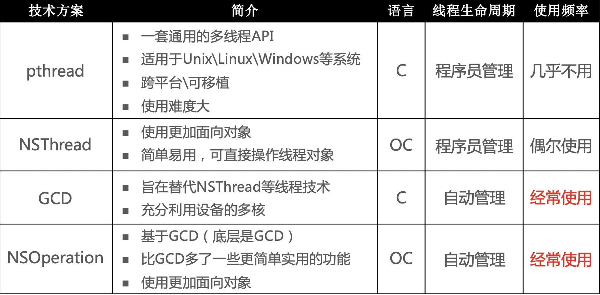

### 10.1.2 GCD的常用函数

```
GCD中有2个用来执行任务的函数
用同步的方式执行任务
dispatch_sync(dispatch_queue_t queue, dispatch_block_t block);
queue：队列
block：任务

用异步的方式执行任务
dispatch_async(dispatch_queue_t queue, dispatch_block_t block);
```
[GCD源码](https://github.com/apple/swift-corelibs-libdispatch)

### 10.1.3 GCD的队列
* GCD的队列可以分为2大类型
  * 并发队列（Concurrent Dispatch Queue）
    * 可以让多个任务并发（同时）执行（自动开启多个线程同时执行任务）
    * 并发功能只有在异步（dispatch_async）函数下才有效

  * 串行队列（Serial Dispatch Queue）
    * 让任务一个接着一个地执行（一个任务执行完毕后，再执行下一个任务）

### 10.1.4 容易混淆的术语

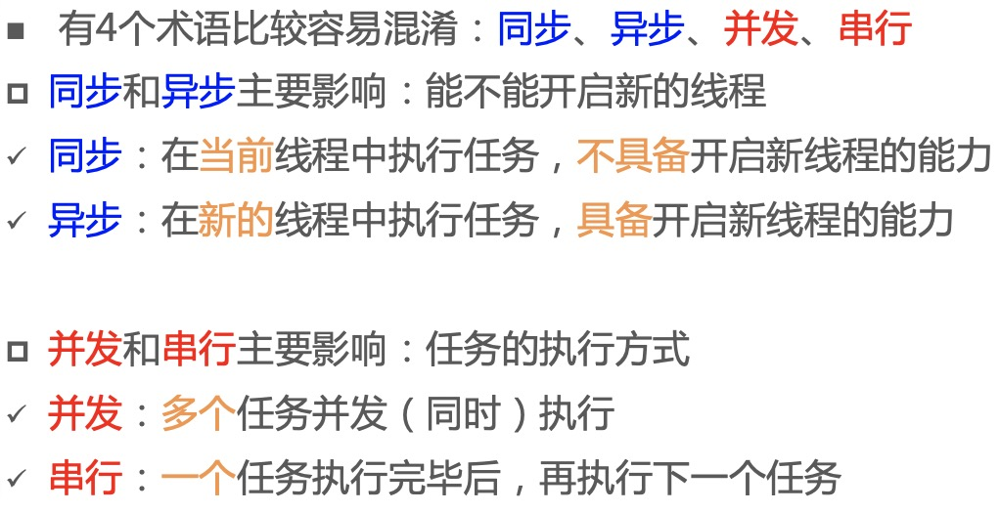

### 10.1.5 各种队列的执行效果

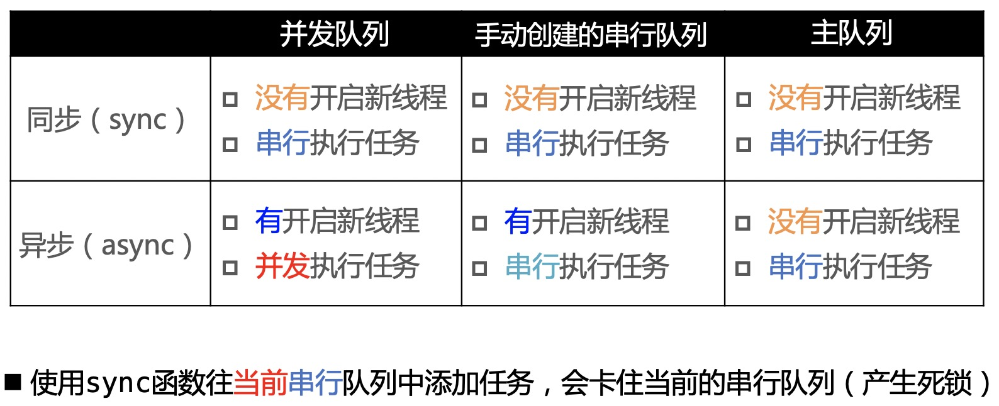

## 10.2 队列组的使用

* 思考：如何用gcd实现以下功能
  * 异步并发执行任务1、任务2
  * 等任务1、任务2都执行完毕后，再回到主线程执行任务3

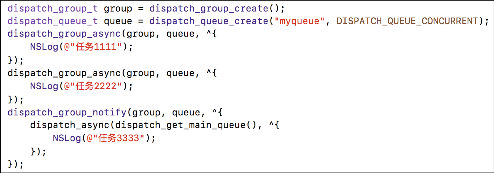

## 10.3 线程同步

### 10.3.1 多线程的安全隐患

* 资源共享
  * 1块资源可能会被多个线程共享，也就是多个线程可能会访问同一块资源
  * 比如多个线程访问同一个对象、同一个变量、同一个文件
* 当多个线程访问同一块资源时，很容易引发数据错乱和数据安全问题

### 10.3.2 存钱取钱

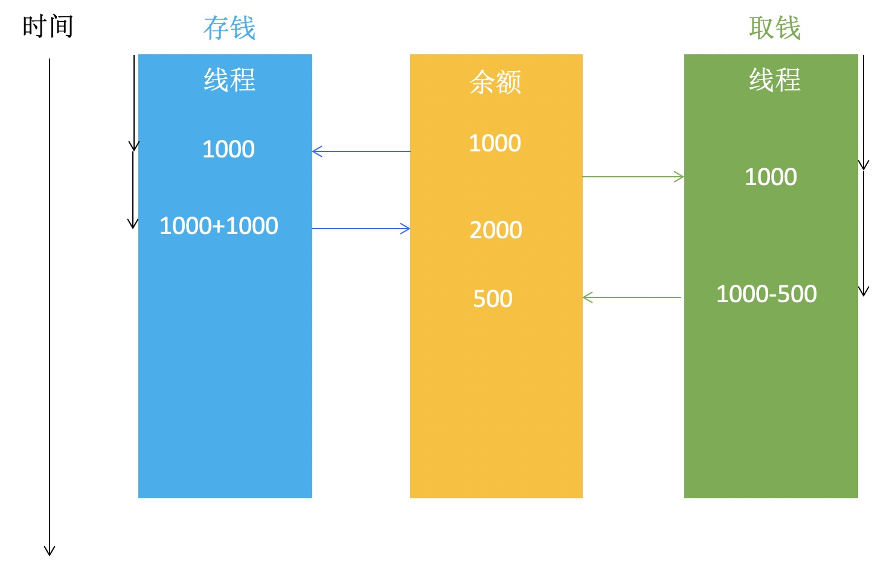

### 10.3.3 卖票

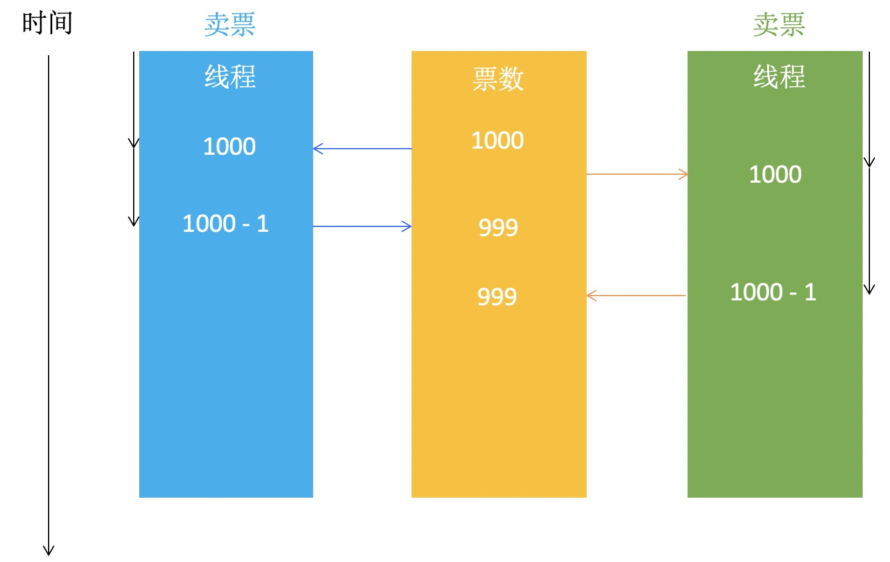

### 10.3.4 多线程安全隐患分析

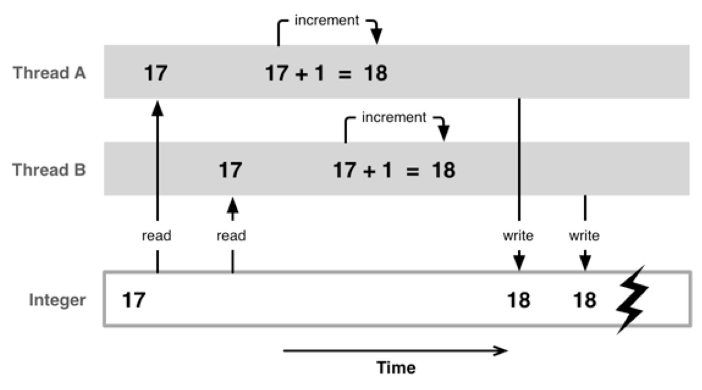

### 10.3.5 多线程安全隐患的解决方案

* 解决方案：使用线程同步技术（同步，就是协同步调，按预定的先后次序进行）
* 常见的线程同步技术是：加锁
  
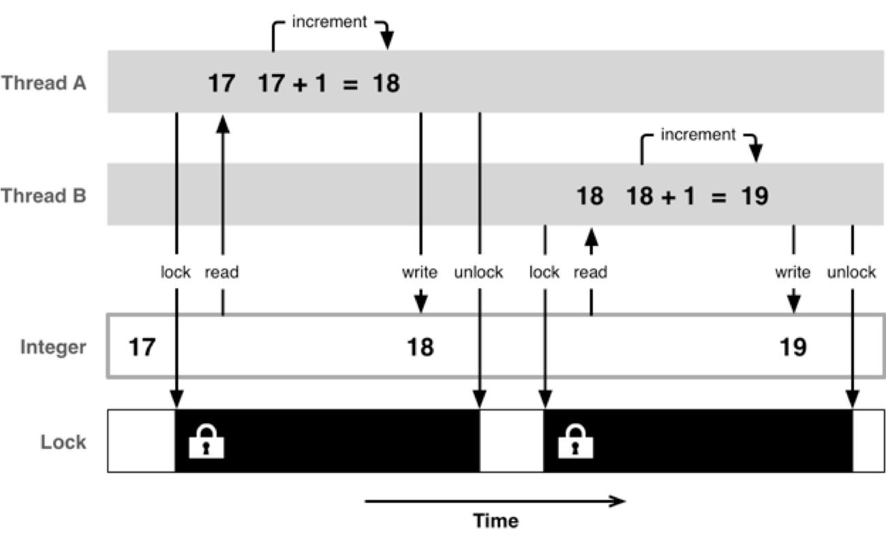

## 10.4 线程同步方案

### 10.4.1 iOS中的线程同步方案
* OSSpinLock
* os_unfair_lock
* pthread_mutex
* dispatch_semaphore
* dispatch_queue(DISPATCH_QUEUE_SERIAL)
* NSLock
* NSRecursiveLock
* NSCondition
* NSConditionLock
* @synchronized

### 10.4.2 GNUstep
* GNUstep是GNU计划的项目之一，它将Cocoa的OC库重新开源实现了一遍
* [源码地址](http://www.gnustep.org/resources/downloads.php)
* 虽然GNUstep不是苹果官方源码，但还是具有一定的参考价值

### 10.4.3 OSSpinLock
* OSSpinLock叫做”自旋锁”，等待锁的线程会处于忙等（busy-wait）状态，一直占用着CPU资源
* 目前已经不再安全，可能会出现优先级反转问题
  * 如果等待锁的线程优先级较高，它会一直占用着CPU资源，优先级低的线程就无法释放锁
  * 需要导入头文件#import <libkern/OSAtomic.h>

>通过时间片轮转调度算法，让每个线程/进程，执行固定时间（如10ms）后切换，实现多线程。使用自旋锁，低优先级的线程，先加锁执行一段时间，切换线程，有高优先级的线程执行已经加锁需要忙等，cpu会让高优先级的线程多执行一会，或者先执行完，低优先级的线程一直没法执行完，释放锁，高优先级线程一直处于忙等状态。


### 10.4.4 os_unfair_lock
* os_unfair_lock用于取代不安全的OSSpinLock ，从iOS10开始才支持
* 从底层调用看，等待os_unfair_lock锁的线程会处于休眠状态，并非忙等
* 需要导入头文件#import <os/lock.h>

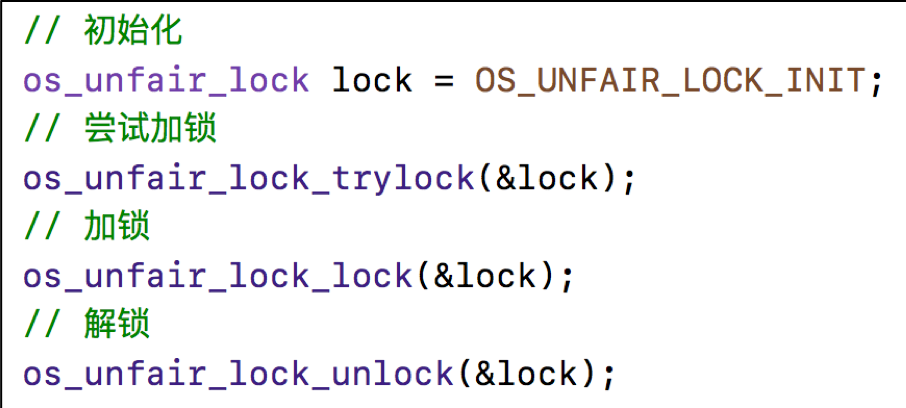

### 10.4.5 pthread_mutex
* mutex叫做”互斥锁”，等待锁的线程会处于休眠状态
* 需要导入头文件#import <pthread.h>

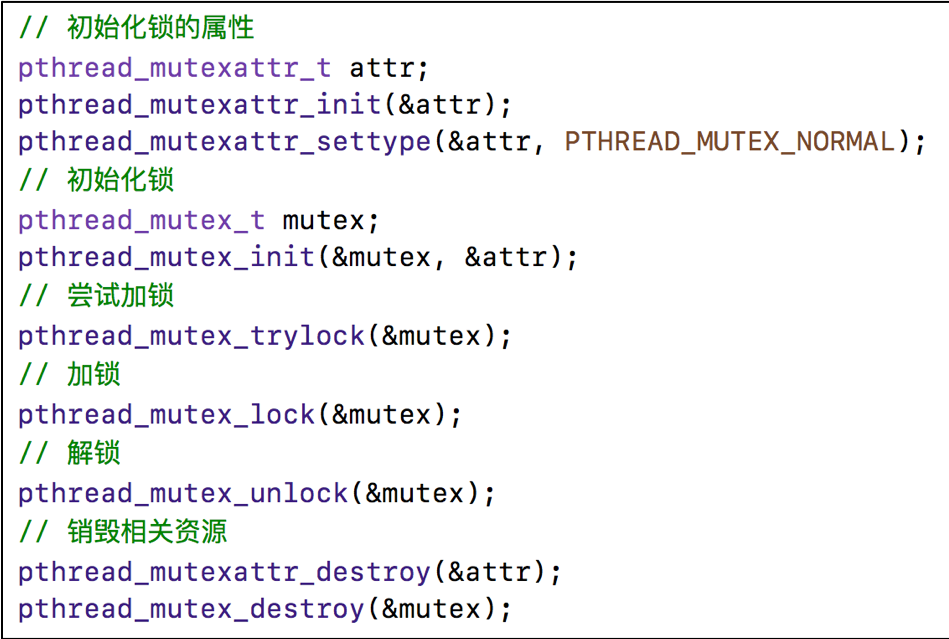


* 递归锁


>递归锁：允许同一个线程对一把锁进行重复加锁

* 条件

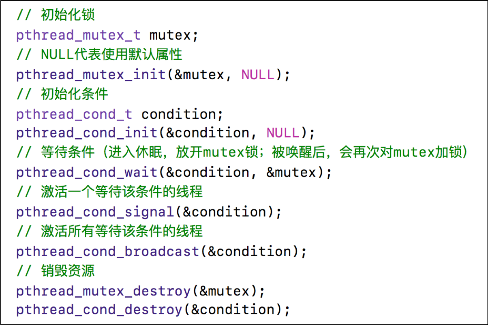

>对应生产者-消费者模型，只有先生产出东西，才能消费

```

```

```
通过查看汇编代码，就可以知道互斥锁、自旋锁的实现原理
stepi/si 单行执行一条汇编，遇到方法调用会跳进去。
nexti/ni 单行执行一条汇编，遇到方法调用会跳过。
c 执行到断点

自旋锁，汇编代码一直循环调用。
互斥锁，线程休眠
```

### 10.4.6 NSLock、NSRecursiveLock


### 10.4.7 NSCondition
* NSCondition是对mutex和cond的封装


### 10.4.8 NSConditionLock

* NSConditionLock是对NSCondition的进一步封装，可以设置具体的条件值


### 10.4.9 dispatch_semaphore
* semaphore叫做”信号量”
* 信号量的初始值，可以用来控制线程并发访问的最大数量
* 信号量的初始值为1，代表同时只允许1条线程访问资源，保证线程同步


### 10.4.10 dispatch_queue
* 直接使用GCD的串行队列，也是可以实现线程同步的


### 10.4.11 @synchronized
* @synchronized是对mutex递归锁的封装
* 源码查看：objc4中的objc-sync.mm文件
* @synchronized(obj)内部会生成obj对应的递归锁，然后进行加锁、解锁操作
```
@synchronized(obj) {
    //任务
}
```

### 10.4.12 iOS线程同步方案性能比较
* 性能从高到低排序
  * os_unfair_lock
  * OSSpinLock
  * dispatch_semaphore
  * pthread_mutex
  * dispatch_queue(DISPATCH_QUEUE_SERIAL)
  * NSLock
  * NSCondition
  * pthread_mutex(recursive)
  * NSRecursiveLock
  * NSConditionLock
  * @synchronized

### 10.4.13 自旋锁、互斥锁比较

* 什么情况使用自旋锁比较划算？
  * 预计线程等待锁的时间很短
  * 加锁的代码（临界区）经常被调用，但竞争情况很少发生
  * CPU资源不紧张
  * 多核处理器

* 什么情况使用互斥锁比较划算？
  * 预计线程等待锁的时间较长
  * 单核处理器
  * 临界区有IO操作
  * 临界区代码复杂或者循环量大
  * 临界区竞争非常激烈

## 10.5 atomic
atomic用于保证属性setter、getter的原子性操作，相当于在getter和setter内部加了线程同步的锁

可以参考源码objc4的objc-accessors.mm  

它并不能保证使用属性的过程是线程安全的

## 10.6 读写安全
### 10.6.1 iOS中的读写安全方案

* 思考如何实现以下场景
  * 同一时间，只能有1个线程进行写的操作
  * 同一时间，允许有多个线程进行读的操作
  * 同一时间，不允许既有写的操作，又有读的操作

* 上面的场景就是典型的“多读单写”，经常用于文件等数据的读写操作，iOS中的实现方案有
  * pthread_rwlock：读写锁
  * dispatch_barrier_async：异步栅栏调用

### 10.6.2 pthread_rwlock
* 等待锁的线程会进入休眠

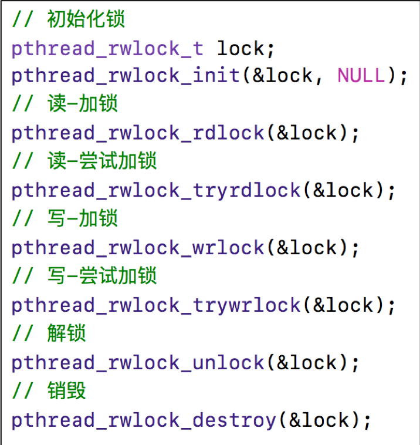

### 10.6.3 dispatch_barrier_async
* 这个函数传入的并发队列必须是自己通过dispatch_queue_cretate创建的
* 如果传入的是一个串行或是一个全局的并发队列，那这个函数便等同于dispatch_async函数的效果


## 面试题

### 1、请问下面代码的打印结果？

```
- (void)gcd_example1 {
    dispatch_queue_t queue = dispatch_get_global_queue(0, 0);
    dispatch_async(queue, ^{
        NSLog(@"1");
        [self performSelector:@selector(test) withObject:nil afterDelay:.0];
        NSLog(@"3");
    })
    
    dispatch_async(queue, ^{
        for (int i = 0; i < 10; i++) {
            NSLog(@"index = %d,thread = %@",i,[NSThread currentThread]);
        }
    });
    
}

- (void)test {
    NSLog(@"2");
}

打印结果是：1、3
原因
performSelector:withObject:afterDelay:的本质是往Runloop中添加定时器
子线程默认没有启动Runloop
```

```
- (void)test
{
    NSLog(@"2");
}

- (void)touchesBegan:(NSSet<UITouch *> *)touches withEvent:(UIEvent *)event {
    NSThread *thread = [[NSThread alloc] initWithBlock:^{
        NSLog(@"1");
    }];
    [thread start];
    
    [self performSelector:@selector(test) onThread:thread withObject:nil waitUntilDone:YES];
}
打印结果：1
然后崩溃

除非启动runloop保活子线程。
```