# 移动端地图技术分享
[<简书 — 刘小壮>](https://www.jianshu.com/p/41179be5893a)

> 本人现就职于国内某地图导航公司，这篇文章是我前段时间在公司组织技术分享的一个PPT，文章内容也主要由这个PPT的内容为主，通过这篇文章可以很好的帮你了解地图导航这个行业的相关技术。  
> PPT内容主要包括地图相关专业知识、百度和高德SDK整体框架、数据来源、行业概览等组成。其中关于地图引擎相关的技术知识，我向公司地图引擎开发同事求证过，这个PPT也给他们看过，也帮忙指出了其中的一些问题。  
> 这篇文章主要用于分享，其中如果有什么问题，还请多多指出，谢谢！  

## 地图开发专业知识

##### 经纬度

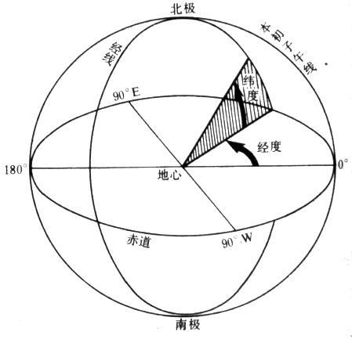

经纬度是一种地理坐标系统，主要用来表示地球的球面坐标系，经纬度可以定位地球的任何一个位置。南北方向的称为 `纬度` ，东西方向称为 `经度` 。

纬度：赤道 `纬度` 周长最长，离赤道越远 `纬度` 周长越短，也就更加靠近南北极。赤道以南称为 `南纬` ，赤道以北称为 `北纬` 。 `纬度` 取值范围是0-90，赤道 `纬度` 最小为0，两级最大。

经度： `经度` 也叫子午线，任意两条经线长度相等，起始点都在南北极。 `经度` 以本初子午线为区分，以东称为 `东经` ，以西称为 `西经` ， `东经` 为正数， `西经` 为负数。 `经度` 取值范围在0-180，本初子午线为0。 `东经` 180度也就是 `西经` 180度就是白令海峡，白令海峡就是国际换日线，日期相差一天。

按照 `经度` ，地球被分为24个时区，每个时区又有分，分又包含秒。

##### 投影

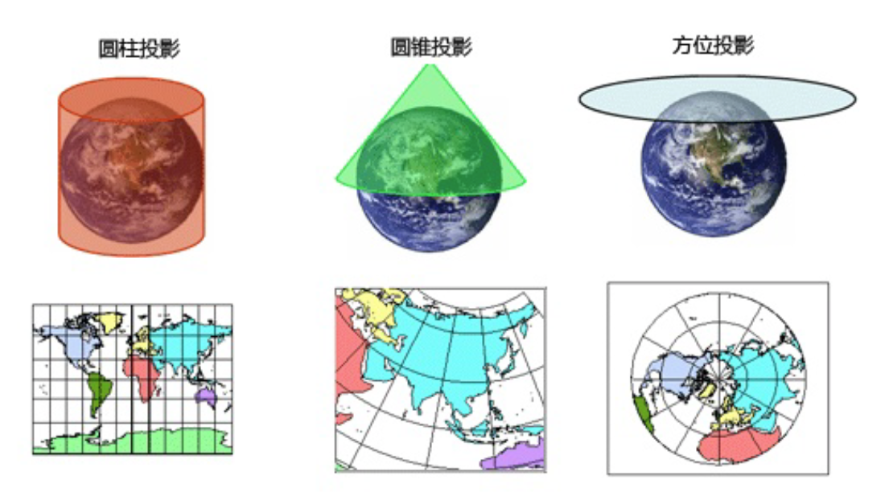

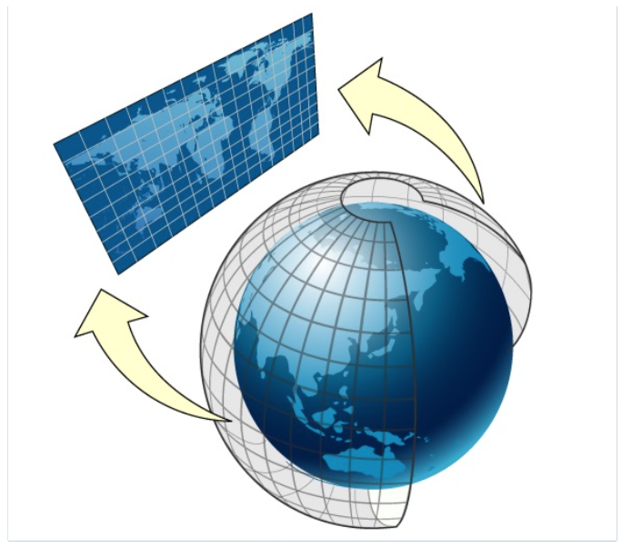

做地图， `投影` 的概念很重要。我们的地球是圆形的，地球的坐标是一个球面坐标，球面坐标是三维坐标(x、y、z)，而我们的地图是是二维的(x、y)，需要将球面的三维坐标转换为平面的二维坐标。

坐标转换久用到了 `投影` 的概念，常用的 `投影` 有： `圆柱投影`、`圆锥投影`、`方位投影` ，而在我们地图导航中使用 `墨卡托投影` 。

##### 墨卡托投影

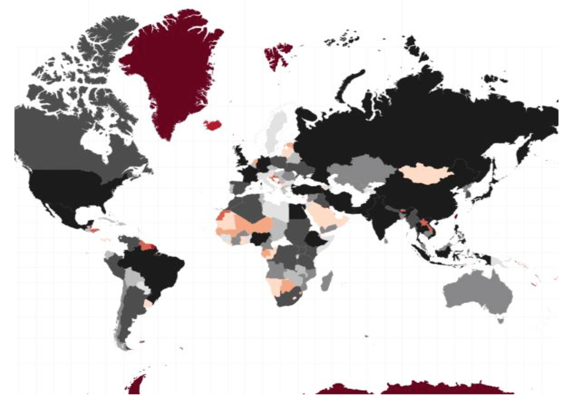

百度、高德、Google都使用 `墨卡托投影` ， `墨卡托投影` 有一个很大的弊端，就是在高纬度( `南纬`、`北纬` )地区产生巨大的变形。变形比较严重的地方在于俄罗斯、格林兰岛、非洲、南极洲等高纬度地区。

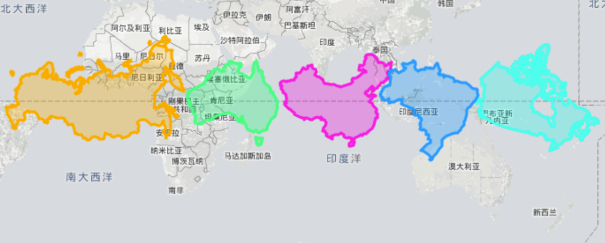

上面五个国家分别是：俄罗斯、澳大利亚、中国、巴西、加拿大
我们将这五个国家放在一个 `纬度` ，来比较这五个国家，发现相差并不太大。但是如果放在上面那张图中，俄罗斯顶好几个中国大小。

国外开发者开发了一个网站，这个网站可以将不同国家拉到同一个 `纬度` ，这时候就能显示出真正比例的国家面积。
网站地址： [http://thetruesize.com/](https://links.jianshu.com/go?to=http%3A%2F%2Fthetruesize.com%2F)

##### 古德投影

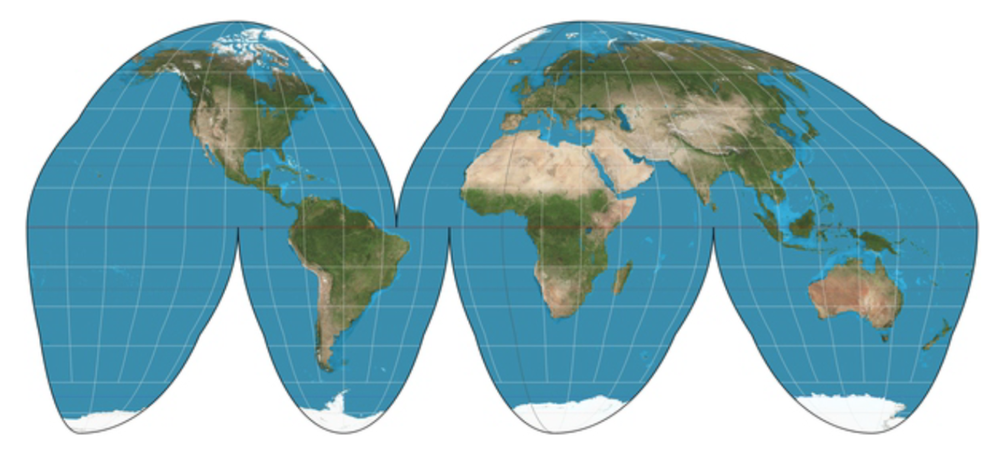

`古德投影` 可以避免地图变形的问题，这种 `投影` 将地图分为几个部分，然后沿赤道将几个部分连接在一起。我们发现上面的格林兰岛已经被分为两部分，这种 `投影` 并不适合用于开发，而且看起来效果也不太好看。

##### 金字塔模型

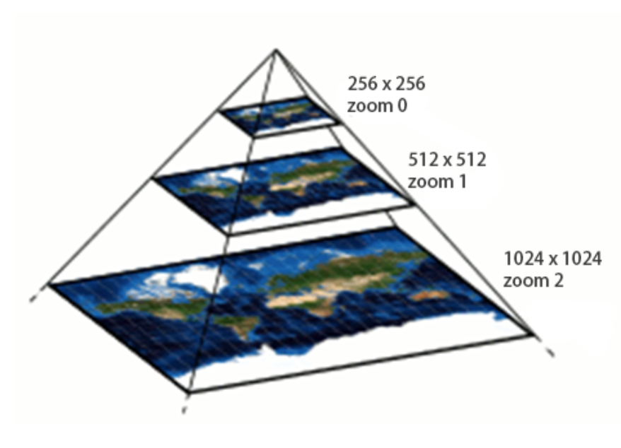

把一张世界地图显示到手机里是不可能的，所以就引入了 `金字塔模型` 的概念(也就是 `比例尺` )，我们可以根据不同的缩放比例，显示不同的分辨率。

在地图应用中，我们用手指缩放和放大地图，地图显示大小的变换，都是基于 `金字塔模型` 来组织瓦片图的。

##### 瓦片坐标系

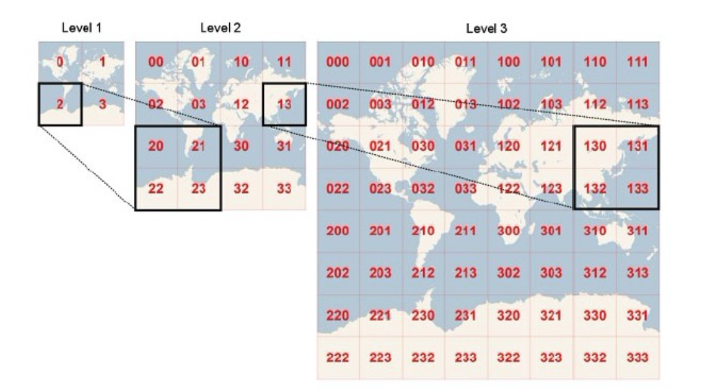

和 `金字塔模型` 配合使用的就是 `瓦片坐标系` ，在不同的缩放等级下，同一块区域 `瓦片` 个数也是不一样的。

`瓦片` 越多就代表这一区域显示越详细，缩放比例也就越大。 `瓦片坐标系` 在2D和3D的场景下都会被使用，我们在网络不好的情况下可以看到地图 `瓦片` 的加载过程以及 `瓦片` 的大小、位置。

##### 坐标加密

* `CLLocationManager` 中的经纬度加密( `WGS-84` )
* `MKMapView` 中的经纬度加密( `GCJ-02` )
* 高德SDK中的经纬度加密( `GCJ-02` )
* 百度SDK中的经纬度加密(使用 `GCJ-02` 再次加密，叫做 `BD-09` )

根据中国法律规定，地图提供商必须对地图经纬度进行偏移，国测局制定了一套加密标准，就是常用的 `GCJ-02` 。 `经纬度坐标` 加密主要有两种格式，GPS坐标系 ( `WGS-84` ) 和火星坐标系 ( `GCJ-02` ) ，加密算法是开源的，可以搜索到。

国际经纬度坐标标准为 `WGS-84` ，国内必须至少使用国测局制定的 `GCJ-02` ，对地理位置进行首次加密。由于每家导航SDK提供方加密都不统一，所以百度、高德、谷歌多家地图数据并不统一，需要再次进行转换。

##### 地图定位

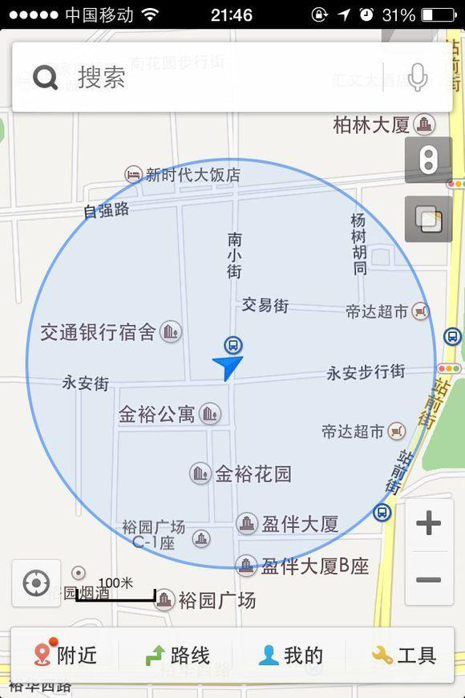

移动端定位方式主要有三种： `GPS`、`Wi-Fi`、`基站` ，但是 `android` 和 `iOS` 还不太一样， `android` 可以让用户选择和设置那种定位方式，但是 `iOS` 是由系统为我们选择的，我们没有操作定位方式的权限。 `iOS` 不允许有第三方定位，所以现在地图应用都是对系统定位进行的封装。如果有 `GPS` 信号， `iOS` 系统会优先选择 `GPS` 方式定位，然后是 `Wi-Fi` 定位，如果 `Wi-Fi` 信号不好就会选择 `基站` 定位。

在定位中精确度最高的是 `Google` ， `Google` 利用大数据分析，记录每一次利用 `Google` 地图的定位。下次再次定位时，直接根据 `Mac地址` 等信息进行分析，提高定位精确度。

比较悲催的一个问题就是，有一些比较老的 `iOS` 机器，没有 `GPS` 定位模块，例如一些老版本 `iPad` ，这种设备在没有 `Wi-Fi` 的情况下是无法定位的。

##### 地理编码和逆地理编码

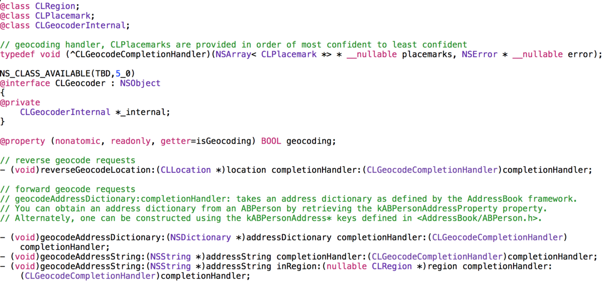

`地理编码` ：即地理解析，由详细的结构化地址得到对应的经纬度信息，例如 `北京市海淀区中关村南大街27号` 的地址，就可以获取到一个唯一的经纬度信息。

`逆地理编码` ：即逆地理解析，由一个经纬度信息获取一个结构化地址信息，例如 `lng:116.31985,lat:39.959836` 经纬度，就可以获取到类似于上面的地理信息。

在 `iOS` 系统API、高德SDK、百度SDK中，都为我们提供了 `地理编码` 和 `逆地理编码` API，但是需要注意经纬度的转换，不同地图SDK返回的经纬度加密方式不同，我们在传入经纬度参数和接收经纬度参数时，都需要做转换。

##### 地图数据来源

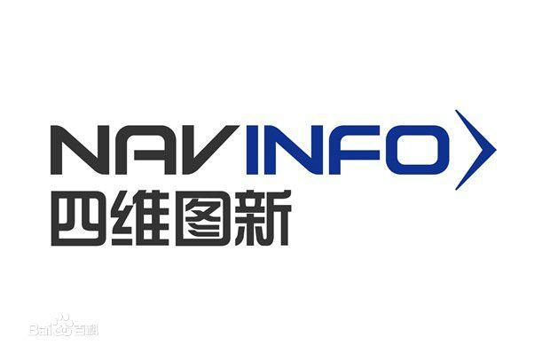

国内比较活跃的数据采集商主要是高德和四维图新两家，百度没有数据采集资质(最近收购了道道通)，所以数据主要依赖于四维图新。

四维图新和国家测绘局合作比较密切，数据来源主要是国家测绘局提供，也有部分自己测绘的数据。高德测绘和航拍能力还不错，主要自己测绘数据，部分数据也依赖国测局提供。数据测绘单位互相之间都有合作，会相互购买自己没有的数据。

在中国，谷歌地图或苹果地图等地图开发商，数据来源几乎都是这两家公司。

##### POI数据

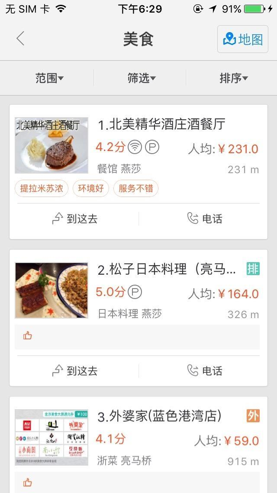

`POI` 数据是一种矢量数据，包括美食、商店、银行、加油站等都是 `POI` 数据，在地图上一般都以气泡或大头针表示。

数据采集可以通过车载 `GPS` 摄像机采集，或从服务性互联网企业抓取或购买，由于百度和高德提供了对外的SDK，通过用户使用地图SDK也可以获取一些数据。

百度的地图数据主要依赖于四维图新和道道通，高德地图主要以自采为主。一般这些数据也会和大众点评、携程、口碑等互联网服务商购买，相互之间也会购买 `POI` 数据。

##### 栅格－2D地图

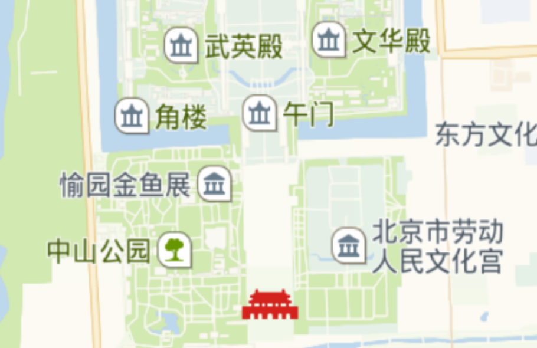

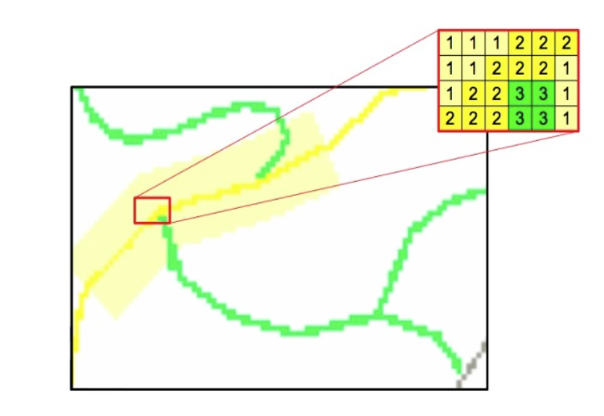

2D场景：轻地图应用，简单的位置分享、兴趣点标注、线路展示等。 `2D模型` 展示效果不太好，在缩放比例较小的情况下，看起来比较模糊(缩放比例大一些看起来清晰度还可以)。

`栅格模型` 对于某一个地方的描述，是通过很多层图片叠加组成的，每层代表不同信息(例如道路)。 `栅格模型` 一般都会先渲染一个底图，然后是在底图的基础上叠加路况、`POI` 等图层。

珊格图都是在服务器预处理的图片，从服务器下载处理好的图片到本地进行拼接即可，由于下载到本地是图片，本地不能再对图层进行更改。对于性能上来说，服务器进行图片合成性能消耗较大，但是客户端性能消耗比较小，内存占用也比较小，用起来会比较流畅。

##### 矢量－3D地图

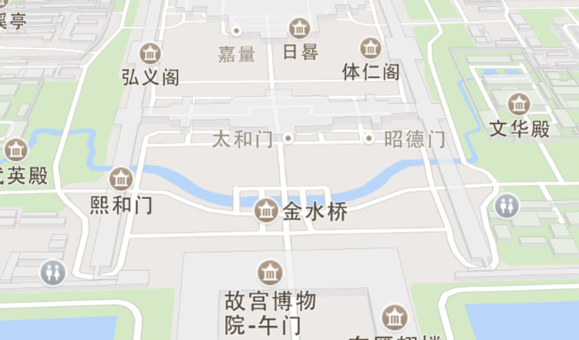

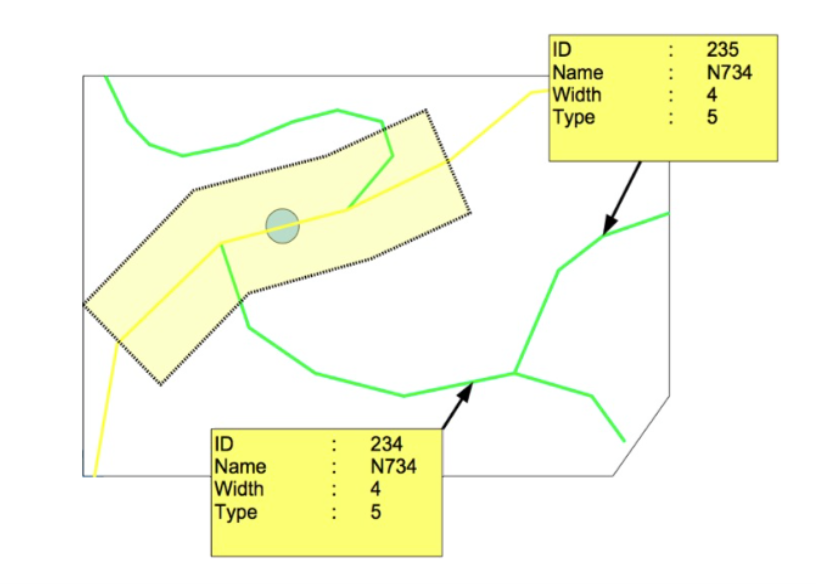

3D场景：重地图应用，以 `LBS` 为核心功能，需要离线地图、更好的渲染效果、app内导航的。比如打车应用、出行导航类应用， `3D模型` 渲染后的效果比较好，一般使用导航功能都必须用这个 `3D模型` 。

矢量数据是从服务器将地图数据下载下来，然后在客户端进行合成绘制的，所以我们可以对地图的显示进行控制，可定制性更强。 `矢量图` 看起来更佳清晰，渲染效果比较好。但是 `矢量图` 对手机性能消耗很厉害，手机内存占用比较高， `CPU`、`GPU` 消耗都很大。对于服务器性能消耗就比 `2D场景` 性能小一些，因为服务器只是加载原始数据和向客户端进行传输，将合成绘制等这些图层渲染的绘制处理交给客户端来做。提高了客户端灵活性和更好的效果，牺牲了客户端的性能，有利有弊。

##### 三维地图

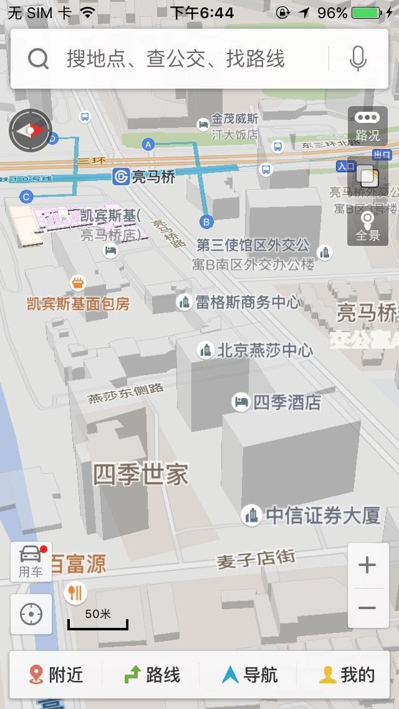

`三维地图` 是以三维地图数据为基础开发的， `三维地图` 看起来更佳立体化，地图上可以呈现出立体建筑及阴影的效果，而且地图随着用户的操作，楼宇的角度、阴影等效果也会随之发生变化。

在 `三维地图` 过渡过程中，也出现过 `假三维地图` 。这种地图只能进行平面平移，不能进行旋转操作，是 `数据平面地图` 和 `三维地图` 过渡的产物。

##### 国外地图

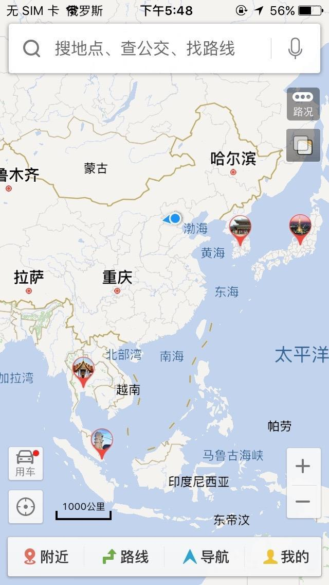

百度地图目前已经可以支持部分国家的国外地图服务，例如新加坡、韩国、日本、泰国等国家。可以在最新的百度地图app上直接查看、搜索这些国家的一些 `POI` ，以及使用导航等功能。

目前为止只有百度一家支持国外地图服务，高德暂时不支持这项服务。在百度和高德不支持的地方，由于服务器没有数据，所以不会做渲染，看起来白白的一片。

##### 实景地图

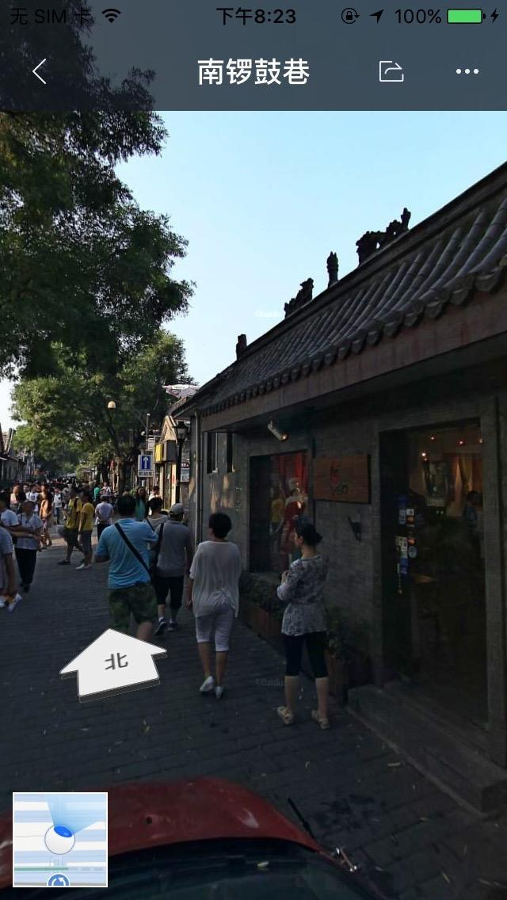

`实景地图` 最开始是 `Google` 研发的，这项技术需要软件和硬件相互的配合，以及大量的数据处理才能完成。

采集实景需要各式实景采集工具，包括汽车采集、自行车采集、人力采集等，这主要是由于需要应对各种采集地点。采集时将数据实时绑定 `GPS` 位置，这样就清楚是在哪个位置采集的。

数据采集后需要工程师将数据进行复杂处理，才能形成我们看到的实景数据。 `实景数据` 一般都是静态的，而且不是实时更新的。 `实景数据` 为了保护被采集人的用户隐私，需要对关键部位进行模糊处理，例如脸、车牌照等。

##### 室内地图

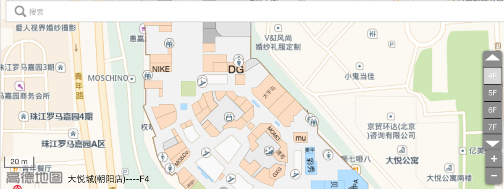

`室内定位` 是一种结合 `3D定位` 的定位模式，这种定位可以在室内进行定位。室内定位直接定位某个商铺在几楼的某个位置，而且可以选择楼层。

在传统的定位中，楼内由于是多层，会导致定位重叠的问题，而且楼内 `GPS` 信号也不太好甚至没有。所以出现了一些新技术来实现楼内定位： `AGPS` (辅助全球卫星定位系统)、`Wi-Fi指纹` 定位、`zigbee芯片` 定位、`RFID智能标签技术`、以及苹果推出的 `ibeacon` ，其中高德使用的是 `Wi-Fi指纹定位` 技术。

##### 百度热力图

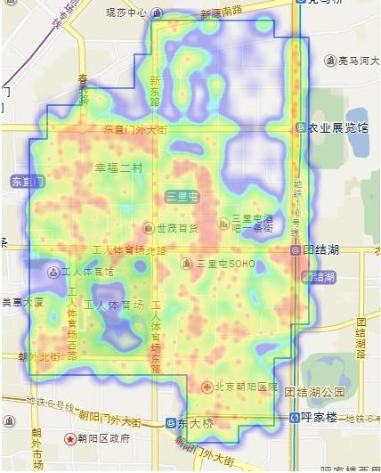

首先是由百度率先支持 `热力图` 功能， `热力图` 功能预示着大数据时代越来越近。热力图是根据百度地图移动客户端和SDK在这些地区的使用情况推断出来的，这些推断数据可以是网络请求、打开次数等，通过这些数据推断出人员分布。通过之前百度在 `CCTV` 的报道来看，通过这些数据甚至可以预测景区拥堵，防止大型踩踏等群体性事件。

`热力图` 随着同一区域的密集程度变化，颜色随之变深。但是由于统计方式的特点，统计的数据并不太准确，例如白天和夜间就有很大区别，只是当作参考。

## 地图SDK架构

##### 高德SDK结构

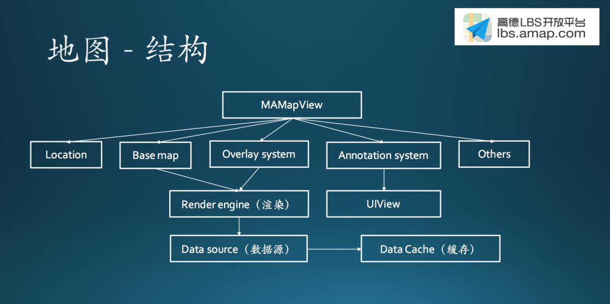

`Annotation` ：单点标注，继承自 `UIView` ，可以使用 `UIView` 的一些基础属性，引入了重用机制(百度也是同样的实现，包括一些打车软件的小车，都是使用 `Annotation` 实现)。

`Overlay` ：多点标注，引擎直接渲染，可以通过SDK的API自定义UI，多点标注用于标识路线或某一个区域。

`Other` ：云搜索，地理编码和逆地理编码，导航路径规划，定位， `POI` 搜索等。

##### MapKit和高德SDK区别

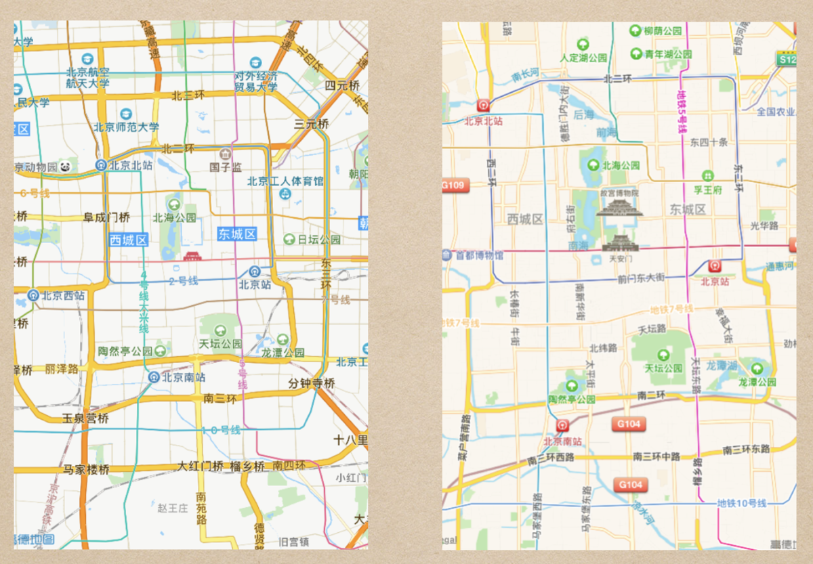

右边图片的高德logo是黑色，并且显示在右下角，这是 `iOS` 系统的 `MapKit.framework`

左边图片的高德logo是蓝色，并且显示在左下角，这是高德自己的SDK。

苹果的 `MapKit` 只是使用了高德的数据，但是API是苹果自己开发的。

##### 百度地图SDK框架

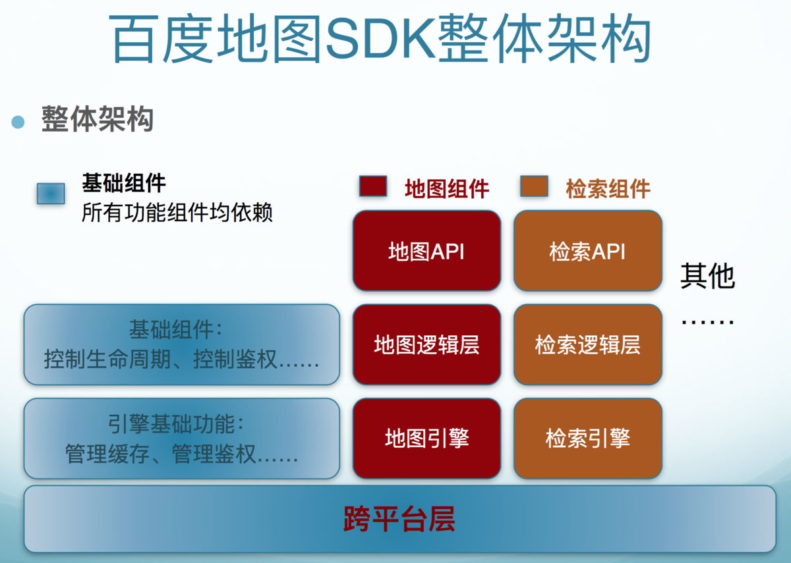

##### 跨平台引擎：

* 百度地图的地图引擎使用 `openGLES` 绘制
* 能够运行于支持 `C++` 的手机系统平台
* 不同平台对应用层保持一致的API接口
* 提供能够满足应用层的基础数据结构
* 尽量少的依赖系统接口，提高可移植性
* 灵活性和可扩展性

百度地图对于高德地图来说，增加了一些实用性的功能，例如热力图、骑行、个性化地图等。这些功能都是高德所没有的，当然高德也有一些很不错的功能，两者各有优点。

百度地图和高德地图都有2D和3D功能，2D纯平面展示，没有楼宇拔高效果。

##### 百度地图SDK框架

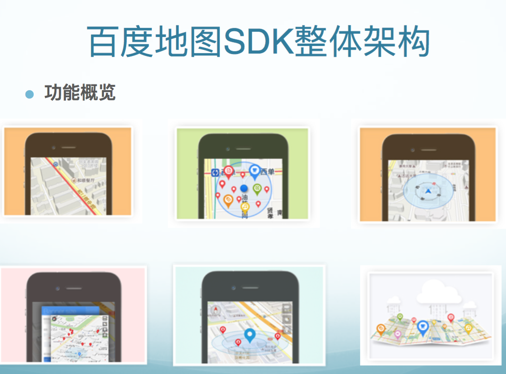

百度SDK主要模块划分：

* 地图(基础功能，地图显示以及操作和各种覆盖物图层)
* 检索( `POI` ，地理编码、路径规划等)
* 定位(提供独立定位模块，经纬度根据国测局二次加密)
* 工具(调用百度客户端，坐标转换等)
* 周边雷达(检索用户信息，查找附近的人，主要用于社交)
* LBS云(区域检索，百度服务器存储数据，可以自己操作，属于开发者自有数据)

百度SDK分为六个大的模块，可以按照需求下载对应的模块，这样使下载下来的SDK体积变小。

百度鉴权认证策略：用户可以通过两种方式与百度开放云进行交互，包括 `认证方式` 和 `匿名方式` 。在SDK中很多地方都用到了 `鉴权认证` ，例如加载地图时认证不通过不会显示地图，百度比较看重SDK的 `鉴权` 。

##### 图层渲染

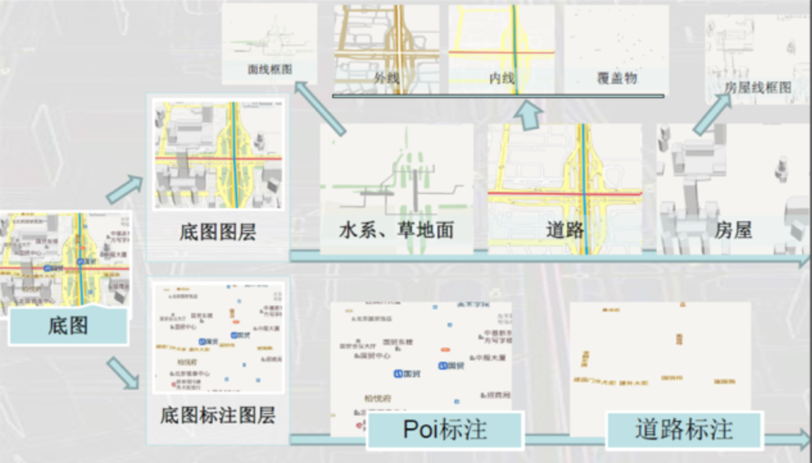

百度地图渲染分为多个图层渲染，每个图层渲染的目标也不一样，地图上自定义标注和覆盖物统称为地图覆盖物，多个图层叠加起来形成 `矢量图` 。百度地图SDK地图等级目前为19级，可以根据缩放等级的不同渲染建筑物、道路、河流、学校、公园等内容。

百度地图支持多点触摸、双击放大、多点缩小、旋转等手势操作。并且支持画点、折线、圆、多边形等操作，并且可以自定义 `热力图`、`瓦片图` 等。

##### 百度个性化地图

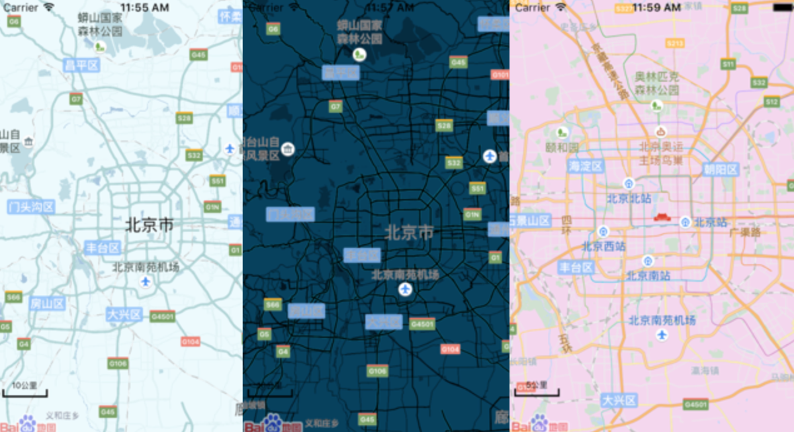

百度地图在16年1月份推出了 `个性化地图` ，SDK提供了个性化地图模版，通过地图模版更改底图颜色和样式。从百度开发者平台下载到模版，通过地图模版可以修改地面、水系、草地、道路、铁路、地铁、`POI` 等颜色和样式，然后调用SDK提供的方法读取该模版即可。

## 地图产业链

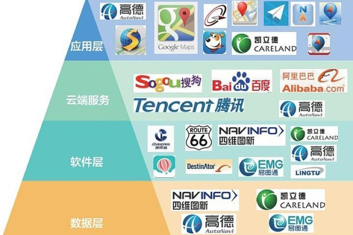

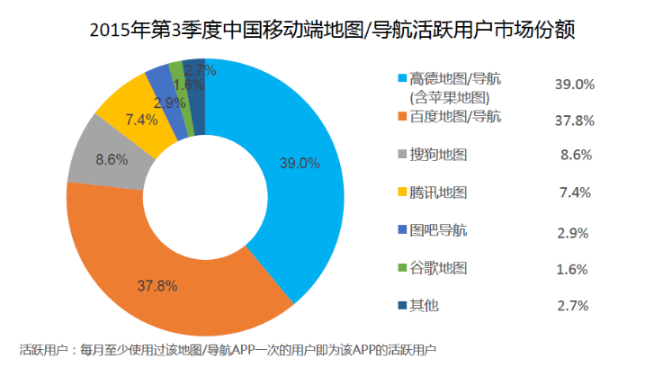

第一张图是一份14年的统计报告，这份统计报告统计不太全面，部分导航应用没有被包含在内。

在这份统计报告中，我们发现高德是唯一一个覆盖整条产业链的企业，在产业链的每个环节都存在高德的身影。

2014年4月，阿里对高德完成了15亿美元的收购，高德成为阿里旗下全资子公司。

这篇文章是我在公司内部组织的一次技术分享，也可以说是技术分析。当时是通过一份PDF进行分享的，我将PDF发在这里，大家可以下载看看，通过PDF看更加直观。

[下载地址](https://links.jianshu.com/go?to=https%3A%2F%2Fpan.baidu.com%2Fs%2F1slCC-aeMeWP6NlUMmsnZQA)
密码：9hsc

[移动端地图技术分享](https://www.jianshu.com/p/41179be5893a)